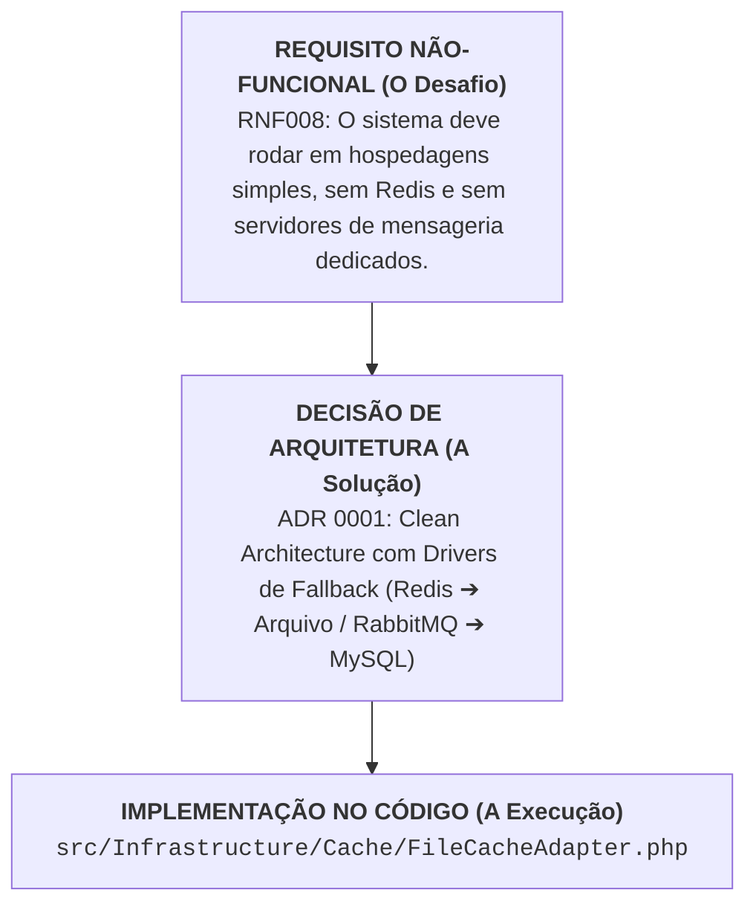

# Engenharia de Requisitos: O Ponto de Partida Absoluto de Qualquer Software
### *A Tríade RF, RNF e Regras de Negócio: Como Saber o Que Construir Antes de Escrever a Primeira Linha de Código*

> 📌 **A Grande Revelação do Ciclo de Vida do Software:**  
> Até aqui, estudamos a estrutura de pastas, a Clean Architecture, o diagrama EER e as ADRs analisando o **Beta Engine SaaS** já existente. No entanto, se você for iniciar um projeto **totalmente do zero (Greenfield)** para um cliente ou startup, **você JAMAIS começa criando pastas ou tabelas no banco**.  
> O ponto de partida universal de todo software bem-sucedido é a **Engenharia de Requisitos**.

---

## 🧭 Sumário
1. [O Paradoxo do Aprendizado: Engenharia Reversa vs. Projeto do Zero](#1-o-paradoxo-do-aprendizado-engenharia-reversa-vs-projeto-do-zero)
2. [A Tríade Fundamental: Requisitos Funcionais, Não-Funcionais e Regras de Negócio](#2-a-tríade-fundamental-requisitos-funcionais-não-funcionais-e-regras-de-negócio)
3. [Decifrando a Tríade com Exemplos Reais do Nosso SaaS](#3-decifrando-a-tríade-com-exemplos-reais-do-nosso-saas)
   - [A. Requisitos Funcionais (RF) "O que o sistema FAZ"](#a-requisitos-funcionais-rf--o-que-o-sistema-faz)
   - [B. Requisitos Não-Funcionais (RNF) "Como o sistema DEVE SER"](#b-requisitos-não-funcionais-rnf--como-o-sistema-deve-ser)
   - [C. Regras de Negócio (RN) "As Leis Inegociáveis da Empresa"](#c-regras-de-negócio-rn--as-leis-inegociáveis-da-empresa)
4. [A Conexão Oculta: Como os RNFs Geram as Suas ADRs](#4-a-conexão-oculta-como-os-rnfs-geram-as-suas-adrs)
5. [A Matriz de Rastreabilidade (Traceability Matrix)](#5-a-matriz-de-rastreabilidade-traceability-matrix)
6. [A Ordem Cronológica Perfeita: O Roadmap de um Projeto do Zero](#6-a-ordem-cronológica-perfeita-o-roadmap-de-um-projeto-do-zero)
7. [Como Documentar Requisitos no Século XXI (Adeus Documentos de 300 Páginas)](#7-como-documentar-requisitos-no-século-xxi-adeus-documentos-de-300-páginas)
8. [Checklist de Qualidade de Requisitos](#8-checklist-de-qualidade-de-requisitos)

---

## 1. O Paradoxo do Aprendizado: Engenharia Reversa vs. Projeto do Zero

Por que muitas pessoas sentem confusão sobre "qual é o primeiro passo"?

Porque existem duas formas de estudar software:
1. **Engenharia Reversa / Manutenção (O que fizemos no início):** Pegamos um sistema existente ou em estágio Alpha, organizamos suas pastas, limpamos as redundâncias e arrumamos as camadas.
2. **Engenharia Direta / Do Zero Absoluto (O que você fará no mercado):** O cliente chega com uma ideia ("preciso de um SaaS para lojas de materiais de construção") e você tem uma tela em branco.

Se em um projeto do zero você abrir o editor e começar criando a pasta `Domain/` ou a tabela `products` no MySQL, você estará **adivinhando o que o cliente precisa**. E adivinhação em engenharia de software é a causa número 1 de falência de projetos.

```
❌ O ERRO DO AMADOR:
[Ideia na cabeça] ➔ [Cria banco no MySQL] ➔ [Sai programando telas] ➔ [O cliente rejeita tudo]

✅ O MÉTODO DO ENGENHEIRO:
[Ideia / Problema] ➔ [Engenharia de Requisitos] ➔ [ADR 0001] ➔ [EER & Casos de Uso] ➔ [Código Limpo]
```

---

## 2. A Tríade Fundamental: Requisitos Funcionais, Não-Funcionais e Regras de Negócio

Para que uma especificação seja precisa, a engenharia divide o conhecimento em três categorias distintas que nunca devem ser misturadas:

```
┌────────────────────────────────────────────────────────────────────────┐
│                        A TRÍADE DOS REQUISITOS                         │
├────────────────────────────────────────────────────────────────────────┤
│ 1. REQUISITOS FUNCIONAIS (RF)        ➔ O QUE o sistema faz             │
│    ↳ Ações, fluxos, telas e cálculos diretos visíveis ao usuário.      │
├────────────────────────────────────────────────────────────────────────┤
│ 2. REQUISITOS NÃO-FUNCIONAIS (RNF)   ➔ COMO o sistema deve se comportar│
│    ↳ Performance, segurança, disponibilidade, padrões e escalabilidade.│
├────────────────────────────────────────────────────────────────────────┤
│ 3. REGRAS DE NEGÓCIO (RN)            ➔ AS LEIS DA EMPRESA              │
│    ↳ Políticas comerciais, fiscais e jurídicas independentes de TI.   │
└────────────────────────────────────────────────────────────────────────┘
```

---

## 3. Decifrando a Tríade com Exemplos Reais do Nosso SaaS

Nos arquivos da pasta [`docs/requirements/`](/docs/requirements/), temos a prova viva de como essa separação funciona:

### A. Requisitos Funcionais (RF) "O que o sistema FAZ"
*Arquivo de referência: [docs/requirements/functional/functional_requirements.yaml](/docs/requirements/functional/functional_requirements.yaml)*

Descrevem os recursos que o sistema deve fornecer aos atores:
* **RF001:** O sistema deve permitir o cadastro de produtos com imagens em alta definição.
* **RF006:** O sistema deve executar a baixa automática de inventário em tempo real após a aprovação de uma venda.
* **RF010:** O sistema deve calcular o valor do frete dinamicamente com base no peso, cubagem e CEP de destino.
* **RF015:** O sistema deve emitir um ticket de pré-venda no balcão com identificador e QR Code para leitura no caixa.

---

### B. Requisitos Não-Funcionais (RNF) "Como o sistema DEVE SER"
*Arquivo de referência: [docs/requirements/non_functional/non_functional_requirements.yaml](/docs/requirements/non_functional/non_functional_requirements.yaml)*

Não dizem respeito a botões ou telas, mas a **critérios de qualidade técnica e restrições arquiteturais**:
* **RNF002 (Performance):** O tempo de carregamento da página (*Largest Contentful Paint - LCP*) deve ser inferior a 2.5 segundos em conexões 4G.
* **RNF003 (Segurança):** Dados sensíveis em repouso devem ser criptografados com AES-256 e tráfego HTTPS obrigatório via TLS 1.3 (em conformidade com a LGPD).
* **RNF004 (Confiabilidade):** O sistema deve manter uma disponibilidade de 99.9% (*uptime* de no máximo 43 minutos de indisponibilidade por mês).
* **RNF008 (Portabilidade):** O sistema deve ser capaz de operar com ou sem Redis/RabbitMQ através de mecanismos de *fallback*, garantindo funcionamento em planos de hospedagem compartilhada.

---

### C. Regras de Negócio (RN) "As Leis Inegociáveis da Empresa"
*Arquivo de referência: [docs/requirements/business_rules/business_rules.yaml](/docs/requirements/business_rules/business_rules.yaml)*

As regras de negócio **existiriam mesmo se o computador não existisse**. Elas são as leis do comércio do cliente:
* **RN001 (Conversão de Cerâmica):** Revestimentos e pisos cerâmicos são precificados em metros quadrados ($m^2$), porém a venda só pode ser concretizada em caixas fechadas inteiras.
* **RN004 (Reserva de Estoque Temporária):** Um item adicionado a uma pré-venda no balcão reserva o saldo de estoque por no máximo 30 minutos; após esse período sem pagamento no caixa, a reserva é cancelada automaticamente.
* **RN007 (Segregação Financeira):** O vendedor do balcão não possui permissão para receber dinheiro ou dar baixa em títulos; somente o operador de caixa autenticado pode liquidar pedidos.

---

## 4. A Conexão Oculta: Como os RNFs Geram as Suas ADRs

Muitos estudantes se perguntam: *"De onde os arquitetos tiram as ideias para escrever as ADRs?"*

A resposta é simples: **As ADRs nascem diretamente dos Requisitos Não-Funcionais (RNFs)!**

Veja como o RNF dita a decisão arquitetural:

```
                  REQUISITO NÃO-FUNCIONAL (O Desafio)
          RNF008: "O sistema deve rodar em hospedagens simples
                   sem Redis e sem servidores de mensageria dedicados."
                                   │
                                   ▼
                   DECISÃO DE ARQUITETURA (A Solução)
          ADR 0001: "Definir padrão Clean Architecture com Drivers de
                     Fallback (Redis ➔ Arquivo / RabbitMQ ➔ MySQL)."
                                   │
                                   ▼
                   IMPLEMENTAÇÃO NO CÓDIGO (A Execução)
          src/Infrastructure/Cache/FileCacheAdapter.php
```


Se você não tiver os RNFs definidos, você não sabe se precisa de NGINX, se precisa de Redis, se precisa de microsserviços ou se um monólito simples resolve o problema.

---

## 5. A Matriz de Rastreabilidade (Traceability Matrix)

Em engenharia de software profissional, **nenhum código existe sem um pai**. A isso chamamos de **Rastreabilidade**:

```
[Regra de Negócio: RN001 (Venda por m² em Caixas)]
                   │
                   ▼ (Origina)
[Requisito Funcional: RF004 (Cálculo de Conversão de Caixas)]
                   │
                   ▼ (Origina)
[Caso de Uso: UC_CLI_004 (Selecionar Variantes & Metragens)]
                   │
                   ▼ (Origina)
[Entidade EER: Product (has columns: box_size, coverage_m2)]
                   │
                   ▼ (Origina)
[Código PHP: src/Domain/Catalog/ValueObjects/SquareMeterQuantity.php]
                   │
                   ▼ (Origina)
[Teste Automatizado: tests/Unit/Domain/Catalog/SquareMeterTest.php]
```

> [!TIP]
> **A Regra da Sobra de Código:**  
> Se você encontrar uma tabela no banco ou uma classe no código que **não atende a nenhum Requisito Funcional** e **não respeita nenhuma Regra de Negócio**, essa classe é código morto (*dead code*) ou desperdício de tempo e deve ser eliminada.

---

## 6. A Ordem Cronológica Perfeita: O Roadmap de um Projeto do Zero

Se você for contratado amanhã para criar um sistema do zero absoluto, esta é a sequência que você deve seguir:

```
┌────────────────────────────────────────────────────────────────────────┐
│            A LINHA DO TEMPO DA ENGENHARIA DE SOFTWARE REAL             │
├────────────────────────────────────────────────────────────────────────┤
│ 1. ENGENHARIA DE REQUISITOS (O Começo de Tudo)                         │
│    ↳ Entrevistar o cliente, levantar RFs, RNFs e Regras de Negócio.    │
│    ↳ Escrever o Glossário Ubíquo (Linguagem do Negócio).               │
├────────────────────────────────────────────────────────────────────────┤
│ 2. ARQUITETURA & ADR 0001                                              │
│    ↳ Com base nos RNFs, escolher o stack (PHP 8.4, Slim, MySQL, NGINX).│
│    ↳ Definir a Clean Architecture e os planos de fallback.             │
├────────────────────────────────────────────────────────────────────────┤
│ 3. CASOS DE USO (UML)                                                  │
│    ↳ Mapear as personas (Atores) e fluxos de alto nível.               │
├────────────────────────────────────────────────────────────────────────┤
│ 4. MODELAGEM DE DADOS (Diagrama EER)                                   │
│    ↳ Desenhar as tabelas e relacionamentos necessários para os RFs.    │
├────────────────────────────────────────────────────────────────────────┤
│ 5. ESTRUTURA FÍSICA & PASTAS                                           │
│    ↳ Executar o script de scaffolding (003_gerar_estrutura_pastas.sh). │
├────────────────────────────────────────────────────────────────────────┤
│ 6. IMPLEMENTAÇÃO (Migrations, Domínio, Casos de Uso, Telas e Testes)   │
│    ↳ Codificar de dentro para fora seguindo a Clean Architecture.      │
└────────────────────────────────────────────────────────────────────────┘
```

---

## 7. Como Documentar Requisitos no Século XXI (Adeus Documentos de 300 Páginas)

No passado (na era do modelo Cascata dos anos 90), os analistas de requisitos passavam 6 meses escrevendo documentos gigantes no Word que ficavam desatualizados antes mesmo de o código começar.

Hoje, a engenharia moderna adota o **Requisitos como Código (*Requirements-as-Code*)**:

1. **Arquivos YAML Versionados no Git:**  
   Assim como fizemos em `docs/requirements/functional/functional_requirements.yaml`, os requisitos moram no próprio repositório, com IDs claros (`RF001`, `RNF001`) e tags de prioridade (`prio: H` para Alta, `M` para Média, `L` para Baixa).
2. **Histórias de Usuário (*User Stories*):**  
   *"Como [Cliente], eu quero [Calcular o frete pelo CEP], para [Saber o custo total antes de pagar]."*
3. **Critérios de Aceite em BDD (Gherkin):**  
   ```gherkin
   Cenário: Tentativa de compra de cerâmica fracionada
     Dado que o piso porcelanato é vendido em caixas de 2.4 m²
     Quando o cliente solicitar 3.0 m²
     Então o sistema deve arredondar para 2 caixas (4.8 m²)
     E alertar o cliente sobre a metragem mínima faturada.
   ```

---

## 8. Checklist de Qualidade de Requisitos

Antes de aprovar um requisito e passar para o desenho do banco ou do código, avalie se ele atende ao acrônimo **INVEST**:

- [ ] **Independente:** O requisito pode ser desenvolvido sem depender de dezenas de outros?
- [ ] **Negociável:** Ele descreve o objetivo e não amarra a interface visual de forma rígida?
- [ ] **Valioso:** Ele entrega um benefício perceptível para o cliente ou negócio?
- [ ] **Estimável:** A equipe técnica compreende o que deve ser feito para estimar o esforço?
- [ ] **Sucinto (Small):** Ele é pequeno o suficiente para ser planejado e testado com clareza?
- [ ] **Testável:** Existe um critério objetivo para dizer se o requisito passou ou falhou no teste?

---

> **Conclusão:**  
> A sua observação foi cirúrgica: **os requisitos são o verdadeiro ponto de partida de qualquer empreendimento de engenharia**. Ao entender como os Requisitos Funcionais originam os Casos de Uso e como os Requisitos Não-Funcionais geram as ADRs, você fecha o ciclo completo da maturidade em desenvolvimento de software.
