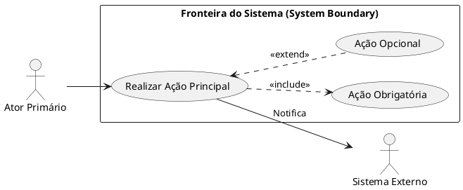

# Diagramas de Casos de Uso (UML): Modelando o Comportamento do Software
### *Como Mapear Atores, Fronteiras do Sistema, Includes, Extends e Conectar os 3 Pilares do SaaS à Camada de Aplicação*

> 📌 **Nota de Estudo:**  
> Se o **Diagrama EER** responde à pergunta: *"Quais dados o sistema armazena?"*, o **Diagrama de Casos de Uso (UML)** responde à pergunta: *"Quem usa o sistema, o que essas pessoas fazem e qual valor de negócio recebem?"*. Ele é a ponte definitiva entre as necessidades do cliente e a **Camada de Aplicação (`src/Application/UseCases/`)** da Clean Architecture.

---

## 🧭 Sumário
1. [Por Que o Diagrama de Casos de Uso é o Elo Fundamental?](#1-por-que-o-diagrama-de-casos-de-uso-é-o-elo-fundamental)
2. [Os 4 Elementos Fundamentais da Notação UML](#2-os-4-elementos-fundamentais-da-notação-uml)
3. [Decifrando a Regra de Ouro: `<<include>>` vs `<<extend>>`](#3-decifrando-a-regra-de-ouro-include-vs-extend)
4. [Os 3 Pilares de Casos de Uso do Beta Engine SaaS](#4-os-3-pilares-de-casos-de-uso-do-beta-engine-saas)
   - [Pilar A: A Loja Virtual & Portal do Cliente (`general_customer_use.puml`)](#pilar-a-a-loja-virtual--portal-do-cliente-general_customer_usepuml)
   - [Pilar B: O Ponto de Venda / Balcão (`general_seller.puml`)](#pilar-b-o-ponto-de-venda--balcão-general_sellerpuml)
   - [Pilar C: O Painel Administrativo & Gestão (`general_dashboard.puml`)](#pilar-c-o-painel-administrativo--gestão-general_dashboardpuml)
5. [A Transposição Perfeita: Da Elipse da UML à Classe em Código](#5-a-transposição-perfeita-da-elipse-da-uml-à-classe-em-código)
6. [Os 4 Erros Mais Comuns em Casos de Uso (Anti-Patterns)](#6-os-4-erros-mais-comuns-em-casos-de-uso-anti-patterns)
7. [Checklist de Validação de Casos de Uso](#7-checklist-de-validação-de-casos-de-uso)

---

## 1. Por Que o Diagrama de Casos de Uso é o Elo Fundamental?

Um dos maiores erros cometidos por programadores é pular da modelagem do banco direto para a programação de telas e controllers. 

Quando isso acontece:
- Cria-se código sem saber quem tem permissão para executá-lo.
- Misturam-se regras de diferentes papéis de usuários (ex: vendedor fazendo papel de caixa).
- Esquece-se de prever integrações com agentes externos (gateways de pagamento, cálculo de frete, emissão fiscal).

### O Papel do Caso de Uso na Arquitetura:
O Diagrama de Casos de Uso estabelece a **Visão Funcional Externa** do sistema. Ele não se preocupa com tabelas, SQL, botões de CSS ou frameworks. Ele define **intenções de negócio**.

```
┌────────────────────────────────────────────────────────────────────────┐
│               A CONEXÃO ENTRE OS MODELOS DE ENGENHARIA                 │
├────────────────────────────────────────────────────────────────────────┤
│ 1. DIAGRAMA EER               ➔ O ESTADO (Tabelas, Colunas, PK/FK)     │
│                                                                        │
│ 2. DIAGRAMA DE CASOS DE USO   ➔ O COMPORTAMENTO (Quem faz o quê)       │
│                                                                        │
│ 3. CLEAN ARCHITECTURE (CÓDIGO)➔ A EXECUÇÃO (Classes de UseCase no PHP) │
└────────────────────────────────────────────────────────────────────────┘
```

---

## 2. Os 4 Elementos Fundamentais da Notação UML



### 1. Atores (Actors)
Representam os papéis que interagem com o sistema (não são pessoas específicas, mas funções):
- **Atores Primários (Humanos):** Iniciam a ação para atingir um objetivo (ex: *Cliente*, *Vendedor*, *Administrador*).
- **Atores Secundários (Sistemas Externos):** Fornecem serviços complementares (ex: *Stripe Gateway*, *API dos Correios*, *SEFAZ / Emissor Fiscal*).
- **Herança de Atores:** Um ator pode herdar direitos de outro. No nosso sistema:  
  `Visitante <|-- Cliente Logado` (O cliente logado faz tudo o que o visitante faz, mais funções exclusivas).  
  `Operador <|-- Administrador Geral` (O administrador herda todas as operações do operador e adiciona configurações globais).

### 2. Casos de Uso (Use Cases - Elipses)
Representam uma **sequência completa de ações** que entrega um resultado observável de valor para o ator.
- **Convenção de Nomenclatura:** Sempre um **Verbo no Infinitivo + Objeto**.  
  *Exemplos:* "Calcular Frete por CEP", "Processar Pagamento", "Emitir Pré-Venda".

### 3. Fronteira do Sistema (System Boundary)
O retângulo que cerca as elipses. Tudo o que está **dentro** é responsabilidade do nosso software; o que está **fora** são os atores e serviços externos.

---

## 3. Decifrando a Regra de Ouro: `<<include>>` vs `<<extend>>`

Essa é a dúvida que mais confunde estudantes e desenvolvedores em exames e no dia a dia da engenharia. Veja a regra simples e definitiva:

```
┌─────────────────────────────────────────────────────────────────────────┐
│                      A DIFERENÇA CRISTALINA                             │
├─────────────────────────────────────────────────────────────────────────┤
│ <<include>> (INCLUSÃO OBRIGATÓRIA - "Sempre Acontece")                  │
│   • A execução do Caso A OBRIGA a execução do Caso B.                   │
│   • A seta pontilhada aponta de quem CHAMA para quem é INCLUÍDO.        │
│   • Exemplo: Finalizar Venda ..> Imprimir Recibo : <<include>>          │
├─────────────────────────────────────────────────────────────────────────┤
│ <<extend>> (EXTENSÃO CONDICIONAL - "Às Vezes Acontece")                 │
│   • O Caso B é opcional, condicional ou uma variação do Caso A.         │
│   • A seta pontilhada aponta de quem ESTENDE de volta para a BASE.      │
│   • Exemplo: Navegar no Catálogo <.. Selecionar Variações : <<extend>>  │
└─────────────────────────────────────────────────────────────────────────┘
```

> [!TIP]
> **O Truque da Dependência:**  
> - Se a funcionalidade básica **não pode terminar com sucesso** sem a outra parte ➔ Use **`<<include>>`**.
> - Se o fluxo básico funciona normalmente sem aquilo, e o passo extra só ocorre em cenários especiais (ou sob escolha do usuário) ➔ Use **`<<extend>>`**.

---

## 4. Os 3 Pilares de Casos de Uso do Beta Engine SaaS

O nosso sistema foi dividido com maestria em três contextos complementares, atendendo a três personas distintas:

```
                             ┌────────────────────────┐
                             │    BETA ENGINE SaaS    │
                             └───────────┬────────────┘
                                         │
        ┌────────────────────────────────┼────────────────────────────────┐
        ▼                                ▼                                ▼
┌───────────────────────┐  ┌───────────────────────────┐  ┌───────────────────────┐
│ 1. LOJA VIRTUAL (E-COM)│  │ 2. PONTO DE VENDA (BALCÃO)│  │ 3. BACKOFFICE (ADMIN) │
│ • Foco: Cliente Final │  │ • Foco: Vendedor & Caixa  │  │ • Foco: Gestão Geral  │
│ • general_customer_   │  │ • general_seller.puml     │  │ • general_dashboard.  │
│   use.puml            │  │                           │  │   puml                │
└───────────────────────┘  └───────────────────────────┘  └───────────────────────┘
```

---

### Pilar A: A Loja Virtual & Portal do Cliente (`general_customer_use.puml`)

Documento: [`docs/business/use-cases/general_customer_use.puml`](file:///var/www/html/Beta_engine_SaaS/docs/business/use-cases/general_customer_use.puml)

Modela a experiência de autoatendimento online:
1. **Visitante (`Guest`):** Navega pelo catálogo, busca produtos com filtros, visualiza variações, calcula frete por CEP e adiciona ao carrinho. Pode realizar a compra como visitante (`Guest Checkout`).
2. **Cliente Logado (`Customer`):** Herda todas as capacidades do visitante e ganha acesso a:
   - Histórico de pedidos e extrato de compras;
   - Gerenciamento de múltiplos endereços de entrega;
   - Lista de desejos (*Wishlist*);
   - Solicitação de devoluções e trocas (RMA);
   - Solicitação de orçamentos complexos para obras (RFQ).
3. **Agente Sistema / Gateway (`System`):** Processa pagamento com Stripe/Pix e sincroniza a sessão do carrinho em memória no Redis.

---

### Pilar B: O Ponto de Venda / Balcão (`general_seller.puml`)

Documento: [`docs/business/use-cases/general_seller.puml`](file:///var/www/html/Beta_engine_SaaS/docs/business/use-cases/general_seller.puml)

Resolve um problema clássico de lojas físicas de materiais de construção e atacado: a **separação entre Venda e Cobrança**.

```
[Cliente no Balcão] ➔ Atendido pelo [Vendedor (Sales Representative)]
                             │
                             ├─ Consulta Estoque Real
                             ├─ Adiciona Itens ao Carrinho
                             ├─ Salva como Pré-Venda Pendente
                             └─ Emite Ticket Impresso com QR Code / Código
                                     │
                                     ▼
[Cliente vai ao Caixa com o Ticket]
                             │
                             ▼
Atendido pelo [Operador de Caixa (Cashier)]
                             │
                             ├─ Localiza Pré-Venda pelo Ticket
                             ├─ Processa Pagamento:
                             │    ├── Pix (QR Code dinâmico)
                             │    ├── Cartão (TEF integrado)
                             │    └── Dinheiro (com cálculo automático de troco)
                             ├─ Finaliza Venda e baixa estoque
                             └─ Imprime Cupom Fiscal / Recibo (NFC-e)
```

Essa modelagem impede filas no balcão e garante que o vendedor **não mexa com dinheiro**, aumentando a segurança e a conformidade trabalhista da operação.

---

### Pilar C: O Painel Administrativo & Gestão (`general_dashboard.puml`)

Documento: [`docs/business/use-cases/general_dashboard.puml`](file:///var/www/html/Beta_engine_SaaS/docs/business/use-cases/general_dashboard.puml)

Modela a administração do SaaS com controle estrito de acesso baseado em papéis (**RBAC**):

1. **Operador do Painel (`Operator`):** Focado no dia a dia da operação comercial:
   - Gestão de produtos, categorias, variações e preços de fornecedores;
   - Aprovação de clientes e classificação em grupos de desconto;
   - Acompanhamento de pedidos, faturamento e devoluções;
   - Consulta de relatórios de desempenho e curvas de estoque.
2. **Administrador Geral (`Admin`):** Herda tudo do operador e possui a custódia das chaves do sistema:
   - Configuração de parâmetros globais do motor e multi-lojas;
   - Gerenciamento de usuários e concessão de privilégios de acesso;
   - Configuração de moedas, regras tributárias e alíquotas fiscais;
   - Gestão de planos de assinatura de clientes recorrentes.

---

## 5. A Transposição Perfeita: Da Elipse da UML à Classe em Código

A beleza da engenharia orientada a casos de uso é que **a arquitetura do código se torna um reflexo exato do diagrama**.

Veja como o caso de uso **`UC_CreateOrder (Criar Pré-Venda no PDV)`** do diagrama `general_seller.puml` vira código real no PHP 8.4:

```
              ┌──────────────────────────────────────────────┐
              │          ELIPSE NO PLANTUML (UML)            │
              │         "Criar Pré-Venda (PDV)"              │
              └──────────────────────┬───────────────────────┘
                                     │ Mapeamento Direto (1:1)
                                     ▼
              ┌──────────────────────────────────────────────┐
              │          CLASSE DE CASO DE USO NO PHP        │
              │  src/Application/POS/UseCases/               │
              │  CreatePreSaleUseCase.php                    │
              └──────────────────────────────────────────────┘
```

### Código Real da Camada de Aplicação (`src/Application/POS/UseCases/CreatePreSaleUseCase.php`):

```php
namespace App\Application\POS\UseCases;

use App\Application\POS\DTOs\CreatePreSaleInputDTO;
use App\Application\POS\DTOs\PreSaleTicketOutputDTO;
use App\Domain\POS\Entities\PreSale;
use App\Domain\POS\Repositories\PreSaleRepositoryInterface;
use App\Domain\Catalog\Repositories\ProductRepositoryInterface;
use App\Domain\Shared\Exceptions\DomainException;

final class CreatePreSaleUseCase
{
    public function __construct(
        private PreSaleRepositoryInterface $preSaleRepository,
        private ProductRepositoryInterface $productRepository
    ) {}

    public function execute(CreatePreSaleInputDTO $dto): PreSaleTicketOutputDTO
    {
        // 1. Instancia o agregado de domínio
        $preSale = PreSale::create(
            sellerId: $dto->sellerId,
            customerId: $dto->customerId
        );

        // 2. Adiciona itens validando regras de estoque (<<include>>)
        foreach ($dto->items as $item) {
            $product = $this->productRepository->findById($item->productId);
            if (!$product || $product->quantity < $item->quantity) {
                throw new DomainException("Estoque insuficiente para o produto: {$product->name}");
            }
            $preSale->addItem($product, $item->quantity);
        }

        // 3. Salva a pré-venda com status 'Pendente'
        $this->preSaleRepository->save($preSale);

        // 4. Retorna os dados para emissão do Ticket
        return new PreSaleTicketOutputDTO(
            ticketCode: $preSale->getTicketCode(),
            totalAmount: $preSale->getTotal(),
            expiresAt: $preSale->getExpirationDate()
        );
    }
}
```

---

## 6. Os 4 Erros Mais Comuns em Casos de Uso (Anti-Patterns)

1. **Decomposição Funcional Excessiva (Micro-Casos de Uso):**
   - ❌ *Erro:* Criar elipses para "Digitar e-mail", "Clicar em enviar", "Validar senha".
   - ✅ *Correção:* Casos de uso representam **metas completas de valor**. O correto é "Autenticar-se no Sistema".
2. **Inversão de Seta no `<<extend>>`:**
   - ❌ *Erro:* Apontar a seta do caso base para a extensão.
   - ✅ *Correção:* A seta pontilhada do `<<extend>>` **sempre aponta da extensão de volta para a base** (pois a base não sabe que a extensão existe).
3. **Esquecer Atores Secundários:**
   - Modelar um pagamento sem incluir o *Gateway de Pagamento* ou a *SEFAZ* como ator externo mascara a complexidade de rede e falhas externas.
4. **Transformar o Caso de Uso em Diagrama de Fluxo:**
   - Não use o diagrama de casos de uso para mostrar passos sequenciais (Passo 1 ➔ Passo 2 ➔ Passo 3). Para sequências de passos, use o **Diagrama de Atividades** ou **Diagrama de Sequência**.

---

## 7. Checklist de Validação de Casos de Uso

Antes de considerar sua modelagem de casos de uso concluída:

- [ ] Todo caso de uso começa com um verbo de ação no infinitivo.
- [ ] Todo caso de uso está conectado a pelo menos um ator (ou incluído/estendido por outro).
- [ ] Atores herdados (`<|--`) possuem clareza sobre quais privilégios acumulam.
- [ ] Toda inclusão obrigatória usa `<<include>>` apontando para o subprocesso.
- [ ] Toda variação opcional usa `<<extend>>` apontando para o fluxo base.
- [ ] Para cada caso de uso no diagrama, existe um arquivo de caso de uso correspondente em `src/Application/.../UseCases/`.

---

> **Conclusão:**  
> Com os diagramas de **E-commerce (`general_customer_use.puml`)**, **Ponto de Venda (`general_seller.puml`)** e **Painel (`general_dashboard.puml`)**, o teu SaaS possui um mapeamento comportamental completo. Eles são a especificação exata do que os programadores devem codificar na camada de aplicação, garantindo que o software construído atenda com fidelidade às necessidades dos teus usuários.
