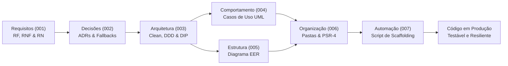

# 🚀 Trilha de Engenharia de Software: Da Concepção ao Código
### *Guia Mestre de Boas Práticas, Arquitetura Limpa, Modelagem de Sistemas e Resiliência em Produção*

---

> 📌 **Apresentação e Filosofia do Projeto:**  
> Este repositório reúne um currículo técnico abrangente, profundo e atemporal de **Engenharia de Software Moderna**. Concebido para estudantes, desenvolvedores, arquitetos de software e tech leads, o guia desconstrói o ciclo de vida completo de um sistema corporativo — desde a primeira entrevista de requisitos com o cliente até a geração automatizada de pastas e código desacoplado e testável.
>
> Utilizando o **Beta Engine SaaS** (uma plataforma multitenant com e-commerce, frente de caixa/PDV e retaguarda administrativa) como estudo de caso prático, este material une rigor acadêmico, clareza didática e o pragmatismo brutal dos ambientes de produção comerciais.

---

## 🧭 O Ciclo de Vida da Engenharia de Software (SDLC)

Na engenharia de software tradicional, muitos projetos fracassam porque o time pula direto para a codificação sem entender o problema ou as restrições da infraestrutura. Para fixar a ordem cronológica correta, utilizamos a metáfora clássica da **Construção de uma Casa**:

```
┌─────────────────────────────────────────────────────────────────────────────────────────────┐
│                            A METÁFORA DA CONSTRUÇÃO CIVIL (SDLC)                            │
├────────────────────────────────┬────────────────────────────────────────────────────────────┤
│ 1. O Terreno e a Demanda       │ ➔ 001: Engenharia de Requisitos (RF, RNF, RN, INVEST)      │
│ 2. A Escolha dos Materiais     │ ➔ 002: Decisões Arquiteturais & ADRs (Resiliência/Fallback)│
│ 3. A Planta Baixa Macro        │ ➔ 003: Arquitetura de Referência (Clean, DDD, Hexagonal)   │
│ 4. A Circulação e Cômodos      │ ➔ 004: Diagramas de Casos de Uso UML (3 Pilares do SaaS)   │
│ 5. A Fundação Estrutural       │ ➔ 005: Modelagem de Dados & Diagrama EER (SSoT)            │
│ 6. As Paredes e Instalações    │ ➔ 006: Estrutura de Pastas & Padrões (PSR-4 / Mapeamento)  │
│ 7. A Automação do Canteiro     │ ➔ 007: Script Automatizado de Scaffolding (Bash CLI)       │
└────────────────────────────────┴────────────────────────────────────────────────────────────┘
```

### Fluxo de Rastreabilidade Ponta a Ponta



---

## 📚 Matriz Geral de Módulos da Trilha

| Módulo | Documento / Recurso | Foco Primário | Principais Entregáveis |
| :--- | :--- | :--- | :--- |
| **000** | [Roadmap e Visão Geral](000_roadmap_e_visao_geral.md) | Visão panorâmica e metodologia | Roteiro Greenfield vs Legacy, metáfora da construção. |
| **001** | [Engenharia de Requisitos](001_engenharia_de_requisitos.md) | O ponto de partida absoluto | Tríade RF/RNF/RN, Matriz de Rastreabilidade, INVEST, Requisitos em YAML. |
| **002** | [Decisões Arquiteturais (ADRs)](002_decisoes_arquiteturais_e_adrs.md) | Resiliência e realidade de produção | Anatomia canônica de ADR, Graceful Degradation, Fallback Redis ➔ APCu/DB e RabbitMQ ➔ MySQL. |
| **003** | [Arquitetura de Referência](003_arquitetura_de_referencia.md) | Padrão arquitetural atemporal | Clean Architecture, DDD, Hexagonal, Action-Domain-Responder (ADR), Inversão de Dependência (DIP). |
| **004** | [Casos de Uso (UML)](004_diagramas_de_casos_de_uso.md) | Modelagem de comportamento | Atores, `<<include>>` vs `<<extend>>`, 3 Pilares do SaaS, Transposição UML ➔ `UseCase.php`. |
| **005** | [Modelagem de Dados & EER](005_modelagem_de_dados_e_eer.md) | Fundação estrutural e persistência | Notação Crow's Foot, Fonte Única da Verdade (SSoT), Capacidade Gerativa para IA/Devs, Migrations. |
| **006** | [Estruturas de Pastas & Padrões](006_estruturas_de_pastas.md) | Organização física de código | 5 vícios amadores eliminados, Mecânica da PSR-4, Armadilha Linux Case-Sensitive, Tabela comparativa PHP vs Java Spring. |
| **007** | [Gerador de Pastas (Scaffolding)](007_gerar_estrutura_pastas.sh) | Automação e produtividade | Script executável Bash (`chmod +x`), `--dry-run`, suporte a `.gitkeep`, validação idempotente. |
| **⚖️** | [Aviso Legal & Isenção](disclaimer.md) | Conformidade acadêmica e legal | Fundamentação na Lei nº 9.610/98 (Direitos Autorais) e Lei nº 9.279/96 (Propriedade Industrial - *Fair Use*). |

---

## 🔍 Detalhamento dos Módulos

### 📄 [Módulo 000: Roadmap e Visão Geral](000_roadmap_e_visao_geral.md)
Apresenta o ecossistema completo de desenvolvimento, as premissas pedagógicas do projeto e a navegação recomendada tanto para projetos criados do zero (*greenfield*) quanto para refatorações graduais de sistemas legados.

### 📄 [Módulo 001: Engenharia de Requisitos: O Ponto de Partida](001_engenharia_de_requisitos.md)
Demonstra por que começar programando telas ou criando tabelas no MySQL sem requisitos formalizados é a principal causa de fracasso em projetos de software.
* **A Tríade dos Requisitos:** Diferenciação semântica estrita entre **Requisitos Funcionais (RF)** (*o que o sistema faz*), **Requisitos Não-Funcionais (RNF)** (*qualidades do sistema: latência, segurança, disponibilidade*) e **Regras de Negócio (RN)** (*políticas do negócio independentes da tecnologia*).
* **Engenharia Moderna:** Critérios INVEST para histórias de usuário, Requisitos como Código em YAML e Matriz de Rastreabilidade Bidirecional.

### 📄 [Módulo 002: Decisões Arquiteturais (ADRs) e Resiliência em Produção](002_decisoes_arquiteturais_e_adrs.md)
Aborda o choque entre o "mundo perfeito do localhost" (onde há Docker ilimitado e 16 GB de RAM) e a realidade das hospedagens compartilhadas e servidores corporativos restritivos.
* **Architecture Decision Records:** Estrutura formal (Contexto, Decisão, Consequências, Conformidade).
* **Engenharia da Resiliência:** Princípio da *Degradação Suave (Graceful Degradation)*. Como criar sistemas que utilizam Redis e RabbitMQ com performance máxima na nuvem, mas que efetuam *fallback* transparente para banco relacional ou memória local sem quebrar o negócio.

### 📄 [Módulo 003: Guia Mestre de Arquitetura de Software Universal](003_arquitetura_de_referencia.md)
O manual definitivo de design arquitetural aplicável a qualquer ecossistema (PHP, Java, TypeScript, C# ou Go).
* **As 4 Camadas Concêntricas:** Domínio (Pure DDD), Aplicação (Casos de Uso), Infraestrutura (Adaptadores/Persistência) e Apresentação (Padrão ADR - Action-Domain-Responder).
* **Inversão de Dependência (DIP):** Como o núcleo de negócios se mantém 100% puro e agnóstico a frameworks, bancos de dados, ORMs ou bibliotecas de terceiros.
* **Exemplo Ponta a Ponta:** Demonstração prática completa de um fluxo de alteração de preço, do Objeto de Valor à Action HTTP.

### 📄 [Módulo 004: Diagramas de Casos de Uso (UML) e os 3 Pilares do SaaS](004_diagramas_de_casos_de_uso.md)
Mapeamento formal de fronteiras de sistema e modelagem de interações de usuários e atores externos.
* **A Regra de Ouro:** A diferença cristalina entre `<<include>>` (etapa mandatória da transação) e `<<extend>>` (comportamento condicional/opcional com ponto de extensão).
* **Os 3 Pilares do SaaS:** Arquitetura do Portal do Cliente, Frente de Caixa / Balcão (PDV) e Retaguarda Administrativa.
* **Do Diagrama ao Código:** Regra matemática de conversão de cada elipse do PlantUML em uma classe executável `UseCase.php`.

### 📄 [Módulo 005: Modelagem de Dados e o Diagrama EER](005_modelagem_de_dados_e_eer.md)
Como o Diagrama EER (Entidade-Relacionamento Estendido) funciona como **Fonte Única da Verdade (SSoT)** para a persistência do sistema.
* **Notação Pé-de-Galinha (*Crow's Foot*):** Leitura de cardinalidades obrigatórias e opcionais (`||`, `|o`, `}|`, `}o`).
* **Poder Generativo:** Como engenheiros e Agentes de IA conseguem gerar migrations SQL, DDLs e classes de entidade diretamente a partir do diagrama PlantUML.
* **A Tríade de Especificação:** A integração simbiótica entre Diagrama EER, Casos de Uso e Migrations de banco de dados.

### 📄 [Módulo 006: Estrutura de Pastas e Padrões de Código](006_estruturas_de_pastas.md)
A organização física e limpa do código-fonte em disco, eliminando de vez pastas genéricas desestruturadas (`helpers/`, `utils/`, `classes/`).
* **Mecânica Interna da PSR-4:** Autoloading do Composer, namespaces virtuais e o perigo de compatibilidade entre Windows (*case-insensitive*) e Linux (*case-sensitive*).
* **Tabela de Equivalência Universal:** Mapeamento paralelo e direto entre as convenções do ecossistema PHP moderno e o padrão Java (Spring Boot / Maven).
* **As 3 Perguntas de Ouro:** Critérios objetivos para decidir onde colocar qualquer arquivo antes de salvá-lo no projeto.

### ⚙️ [Módulo 007: Script de Automação de Scaffolding](007_gerar_estrutura_pastas.sh)
Script utilitário em Bash profissional (`set -euo pipefail`), modular e colorido para construir fisicamente em segundos a árvore completa de pastas da arquitetura limpa.
* Criação idempotente de diretórios (`mkdir -p`).
* Suporte nativo a simulação (`--dry-run`).
* Inicialização opcional de marcadores `.gitkeep`.
* Relatório consolidado com métricas de diretórios e arquivos gerados.

---

## 💡 Princípios e Diferenciais Desta Trilha

```
┌───────────────────────────┬──────────────────────────────────────────────────────────┐
│ PRINCÍPIO                 │ COMO É APLICADO NESTE GUIA                               │
├───────────────────────────┼──────────────────────────────────────────────────────────┤
│ 🎯 Resiliência Pragmática │ Softwares preparados tanto para nuvens elásticas quanto   │
│                           │ para servidores de hospedagem simples de baixo custo.    │
│                           │                                                          │
│ 📐 Rastreabilidade Total  │ Cada linha de código mapeia diretamente para um Caso de  │
│                           │ Uso, que mapeia para um Requisito Funcional ou Negócio.  │
│                           │                                                          │
│ 🌐 Neutralidade Tecnológica Os padrões apresentados (Clean Arch, DDD, EER) são     │
│                           │ universais e se aplicam a PHP, Java, Go, TypeScript e C#.│
│                           │                                                          │
│ 🤖 Prontidão para IA      │ Arquitetura modular e especificações padronizadas que    │
│                           │ facilitam a atuação precisa de Agentes de IA de coding.  │
└───────────────────────────┴──────────────────────────────────────────────────────────┘
```

---

## 🛠️ Como Utilizar Este Repositório na Prática

### Cenário A: Criando um Projeto do Zero (Greenfield)
Se você está iniciando um novo software para um cliente ou nova empresa:
1. **Comece pelo Módulo [001](001_engenharia_de_requisitos.md):** Catalogue os Requisitos Funcionais, Não-Funcionais e Regras de Negócio junto ao cliente.
2. **Documente Decisões Técnicas no [002](002_decisoes_arquiteturais_e_adrs.md):** Crie as primeiras ADRs definindo estratégias de resiliência e infraestrutura mínima.
3. **Desenhe o Comportamento no [004](004_diagramas_de_casos_de_uso.md) e Dados no [005](005_modelagem_de_dados_e_eer.md):** Modele casos de uso UML e o diagrama EER.
4. **Construa a Infraestrutura Física com o [007](007_gerar_estrutura_pastas.sh):**
   ```bash
   # 1. Torne o script executável
   chmod +x 007_gerar_estrutura_pastas.sh

   # 2. Execute uma simulação segura
   ./007_gerar_estrutura_pastas.sh --dry-run /caminho/do/seu/novo-projeto

   # 3. Crie a estrutura real
   ./007_gerar_estrutura_pastas.sh /caminho/do/seu/novo-projeto
   ```
5. **Implemente as Camadas do [003](003_arquitetura_de_referencia.md):** Escreva primeiro as Entidades de Domínio, em seguida os Casos de Uso, e por último os Adaptadores de Infraestrutura e Telas.

### Cenário B: Refatorando um Sistema Existente (Legacy Migration)
Se você tem um monolito ou código legado com alto acoplamento:
1. Consulte a seção de **Vícios Amadores** no Módulo [006](006_estruturas_de_pastas.md) para identificar pontos críticos (ex: SQL dentro de controllers).
2. Isole as Regras de Negócio em uma pasta `src/Domain/` conforme orientado no Módulo [003](003_arquitetura_de_referencia.md).
3. Crie interfaces de repositório aplicando a **Inversão de Dependência (DIP)** para desacoplar as consultas SQL da regra central.
4. Utilize o Módulo [002](002_decisoes_arquiteturais_e_adrs.md) para criar adaptadores com suporte a fallback de infraestrutura.

---

## ⚖️ Conformidade Legal e Isenção de Responsabilidade

Todas as referências a marcas registradas, produtos comerciais e plataformas tecnológicas de nuvem ou hospedagem são realizadas para fins estritamente **educacionais, didáticos e de ilustração técnica**, em conformidade com:
* **Lei Federal nº 9.610/1998 (Art. 46):** Legislação Brasileira de Direitos Autorais (*Citação para fins de estudo e análise técnica*).
* **Lei Federal nº 9.279/1996 (Art. 132, IV):** Legislação Brasileira de Propriedade Industrial (*Livre citação sem conotação comercial*).
* **Doutrina Internacional do *Fair Use*:** Emprego descritivo e transformativo para ensino.

Para ler a declaração legal completa, consulte o documento [`disclaimer.md`](disclaimer.md).

---

## 🤝 Metodologia & Apoio Cognitivo

Este currículo técnico é mantido com base em pesquisa contínua e padrões internacionais da engenharia de software (IEEE, Martin Fowler, Robert C. Martin, Eric Evans, PHP-FIG). As sínteses pedagógicas, diagramas textuais e códigos de exemplo contam com a assistência aceleradora de ferramentas avançadas de Inteligência Artificial Generativa (*Antigravity / Gemini*).

<p align="center">
  <b>Engenharia de Software de Verdade: Da Concepção ao Código.</b><br>
  <i>Desenvolvido para criar sistemas robustos, manuteníveis e preparados para qualquer escala.</i>
</p>
