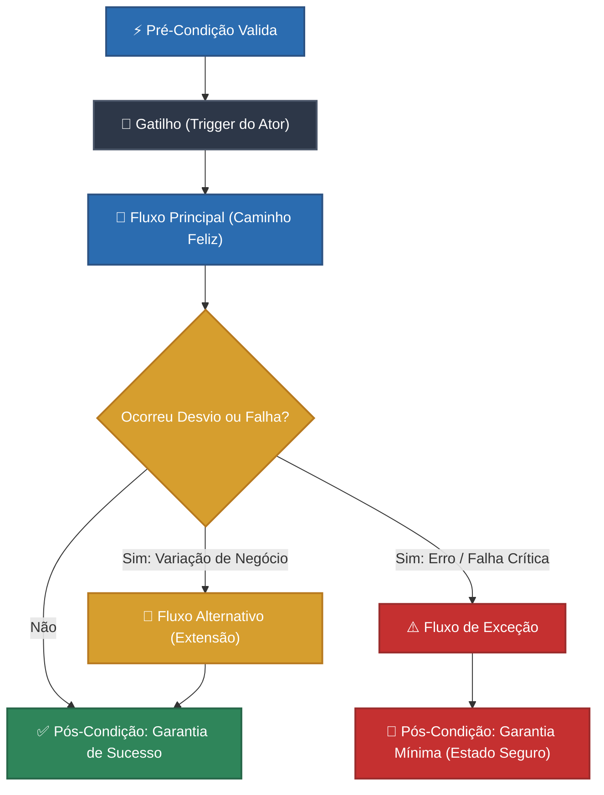

# 🏛️ Guia Prático de Casos de Uso (Use Cases)

> **"Um Caso de Uso é um contrato de comportamento firmado entre os stakeholders de um sistema."** — Alistair Cockburn, *Writing Effective Use Cases*  
> O **Caso de Uso (Use Case)** é o artefato central que conecta os objetivos de negócio dos atores às capacidades funcionais do software. Ele descreve, em linguagem clara, inequívoca e estruturada, como um ator interage com o sistema para atingir uma meta de valor mensurável.

---

## 1. Por que documentar Casos de Uso na Era Ágil?

Com a popularização do Scrum e de abordagens ágeis, muitos times reduziram seus requisitos a cartões rápidos de **Histórias de Usuário** (*User Stories*):  
*"Como [usuário], quero [ação], para [benefício]"*.

Embora as Histórias de Usuário sejam excelentes fichas de priorização e planejamento, elas são **insuficientes** quando o sistema precisa tratar:
* Fluxos com múltiplas ramificações, exceções e regras fiscais/bancárias complexas;
* Múltiplos atores interagindo concorrentemente (ex: Cliente, Gateway de Pagamento, Operador Logístico, Sistema Antifraude);
* Transações que exigem garantias formais de sucesso e reversão (*rollbacks* / compensações);
* Rastreabilidade direta para arquiteturas como **Clean Architecture** (onde o Caso de Uso é a própria camada de orquestração do domínio).

```
   ┌──────────────────────────────────────────────────────────────┐
   │                     Visão Estratégica                        │
   │  Requisitos de Negócio (RN) & Requisitos Funcionais (RF)     │
   └──────────────────────────────┬───────────────────────────────┘
                                  │
                                  ▼
   ┌──────────────────────────────────────────────────────────────┐
   │             O Caso de Uso (Contrato Comportamental)          │
   │  "Quem faz o que, sob quais regras, e o que acontece se der  │
   │   certo ou errado?" (Fluxo Principal, Alternativo e Exceção) │
   └──────────────┬───────────────────────────────┬───────────────┘
                  │                               │
                  ▼                               ▼
   ┌──────────────────────────────┐ ┌─────────────────────────────┐
   │  Engenharia de Software      │ │  Qualidade & Testes (QA)    │
   │  - Clean Architecture UseCase│ │  - BDD (Given / When / Then)│
   │  - Services & Domain Models  │ │  - Testes E2E e de Regressão│
   └──────────────────────────────┘ └─────────────────────────────┘
```

O Caso de Uso atua como o **pilar de alinhamento irrefutável**: o time de Produto entende a entrega de valor, o time de Desenvolvimento programa sem ambiguidades e o time de Qualidade (QA) deriva cenários de testes completos.

---

## 2. A Anatomia Fundamental de um Caso de Uso

Para que um Caso de Uso seja eficaz, ele não deve ser um texto corrido informal nem uma descrição de cliques de interface gráfica. Ele deve conter os seguintes elementos fundamentais:



### 2.1 Atores (Quem participa?)
* **Ator Primário:** Aquele que inicia a interação para atingir o objetivo principal (ex: *Cliente*, *Comprador PJ*, *Administrador*).
* **Ator Secundário (ou de Suporte):** Sistema externo ou serviço consultado pelo nosso software para viabilizar a operação (ex: *Gateway Cielo/Pagar.me*, *Sistema de Correios/Melhor Envio*, *ERP SAP*, *Anti-fraud Engine*).
* **Interessado Oculto (*Stakeholder Offstage*):** Não toca no sistema diretamente, mas possui regras que devem ser protegidas (ex: *Fisco/Receita Federal* exigindo nota fiscal, *Auditoria de Compliance*).

### 2.2 Níveis de Granularidade (Cockburn's Goal Levels)
Nem toda ação do usuário merece um Caso de Uso isolado. Use a metáfora clássica de Alistair Cockburn para calibrar o nível:

| Ícone | Nível | Foco / Escopo | Exemplo Correto | Anti-exemplo (Evitar) |
| :---: | :--- | :--- | :--- | :--- |
| ☁️ | **Nuvem / Resumo** (*Sky / Kite*) | Metas de negócio amplas que envolvem múltiplos casos de uso ao longo de horas ou dias. | "Comprar Materiais de Construção para Obra" | "Navegar na Internet" |
| 🌊 | **Nível do Mar** (*Sea Level*) **[RECOMENDADO]** | **A meta clássica de um Caso de Uso.** Realizada por um único ator, em uma única sessão (2 a 15 minutos), entregando valor de negócio claro. | `UC_CHK_001`: "Finalizar Compra via PIX" | "Inserir chave PIX no campo" |
| 🐟 | **Submarino / Peixe** (*Fish / Black*) | Subfunções técnicas e reutilizáveis invocadas por outros casos de uso via `<<include>>`. | `UC_SEC_001`: "Autenticar com 2FA" | "Clicar no botão OK" |

---

## 3. Relacionamentos UML: `<<include>>` vs `<<extend>>`

Dois dos recursos mais poderosos da modelagem comportamental são as relações de inclusão e extensão:

```
                     ┌───────────────────────────────┐
                     │         UC_CHK_001            │
                     │  Finalizar Compra no Checkout │
                     └───────┬───────────────┬───────┘
                             │               │
            <<include>>      │               │     <<extend>>
      (Obrigatório / Sempre) │               │   (Opcional / Ponto de Extensão)
                             ▼               ▼
      ┌───────────────────────────┐   ┌───────────────────────────┐
      │        UC_PAG_001         │   │        UC_CUP_001         │
      │ Processar Transação no GW │   │  Aplicar Cupom Promocional│
      └───────────────────────────┘   └───────────────────────────┘
```

1. **`<<include>>` (Inclusão Obrigatória):**  
   O caso de uso base **sempre** executa o caso incluído como parte obrigatória de seu fluxo. Elimina duplicação de lógica (ex: *Finalizar Compra* **inclui** obrigatoriamente *Processar Pagamento*).
2. **`<<extend>>` (Extensão Condicional):**  
   O caso de uso de extensão só é acionado sob uma condição específica em um determinado **ponto de extensão** (*extension point*). O fluxo base funciona perfeitamente sem ele (ex: *Finalizar Compra* pode ser estendido por *Aplicar Cupom de Desconto* somente se o cliente possuir um código promocional válido).

---

## 4. Padrão de Nomenclatura e Estrutura de Pastas

No modelo **Docs-as-Code**, os casos de uso devem ser versionados em arquivos Markdown dentro de diretórios departamentais ou orientados a domínios/módulos (*Bounded Contexts*):

```
docs/business/use-cases/
├── use-cases.md                                  # Este guia normativo
├── customer/                                     # Visão do Cliente da Loja
│   ├── UC_CLI_001_navegar_catalogo.md
│   ├── UC_CLI_002_buscar_produtos_filtros.md
│   └── UC_CLI_003_gerenciar_carrinho.md
├── checkout/                                     # Transações e Vendas
│   ├── UC_CHK_001_finalizar_pedido_pix.md
│   └── UC_CHK_002_finalizar_pedido_cartao.md
├── admin/                                        # Backoffice e Gestão
│   ├── UC_ADM_001_aprovar_limite_credito_pj.md
│   └── UC_ADM_002_cadastrar_novo_produto.md
└── integration/                                  # Atores de Sistema / B2B
    └── UC_INT_001_sincronizar_estoque_erp.md
```

### Regras de Nomenclatura:
* **Identificador:** `UC_[DOMINIO]_[NUMERO_SEQUENCIAL]`
  * `CLI`: Cliente / Vitrine da Loja
  * `CHK`: Checkout / Pagamentos
  * `ADM`: Administração / Backoffice
  * `INT`: Integração / M2M
  * `LOG`: Logística e Despacho
* **Nome do Arquivo:** `UC_[DOM]_[NNN]_[verbo_no_infinitivo]_[objeto].md` (em minúsculas, separado por underlines).  
  * *Exemplo:* `UC_CHK_001_finalizar_pedido_pix.md`

---

## 5. O Template Canônico de Caso de Uso

> [!NOTE]
> **Exemplo Prático Disponível:**  
> Você pode consultar uma implementação real deste template em [UC_CLI_001_navegar_catalogo.md](file:///var/www/html/tutoriais/artefatos/docs/business/use-cases/customer/UC_CLI_001_navegar_catalogo.md), que descreve a navegação e busca facetada no catálogo de produtos.

Abaixo está o modelo oficial de Caso de Uso em formato Markdown, pronto para ser copiado e preenchido para qualquer novo fluxo:

````markdown
# UC_[MOD]_[NNN] - [Nome do Caso de Uso: Verbo no Infinitivo + Objeto]

## 📋 Informações do Caso de Uso

| Atributo | Detalhe |
| :--- | :--- |
| **Identificador** | `UC_MOD_NNN` |
| **Nome** | [Título com Verbo no Infinitivo] |
| **Módulo / Domínio** | [Ex: Vendas / Checkout / Catálogo / Gestão de Clientes] |
| **Atores Primários** | [Ex: Cliente Logado, Comprador PJ, Operador de Caixa] |
| **Atores Secundários** | [Ex: Gateway Pagar.me, ERP Totvs, Sistema Antifraude ClearSale] |
| **Tipo** | [Essencial / Condução / Suporte / Integração] |
| **Frequência de Uso** | [Baixa / Média / Alta / Muito Alta (contínua)] |
| **Rastreabilidade** | **RF:** [RF00X](/docs/requirements/functional/rf.md)<br>**RN:** [RN00X](/docs/requirements/business_rules/rn.md)<br>**RNF:** [RNF00X](/docs/requirements/non_functional/rnf.md) |

---

## 1. 🎯 Descrição Sumária
[Breve resumo em 1 parágrafo explicando a intenção do ator, o valor de negócio entregue e o escopo da operação.]

---

## 2. ⚡ Pré-Condições
[Quais condições de sistema e de dados DEVEM ser verdadeiras antes que este caso de uso possa sequer iniciar?]
1. O ator deve estar autenticado no sistema com perfil ativo.
2. Deve haver itens válidos no carrinho de compras.

---

## 3. ✅ Pós-Condições
### 3.1 Garantia de Sucesso (Primary Goal Reached)
[Qual é o estado final do sistema quando o objetivo é 100% cumprido com êxito?]
* O pedido é gravado no banco de dados com status `AGUARDANDO_PAGAMENTO`.
* O estoque dos produtos é reservado temporariamente por 30 minutos.
* O QR Code do PIX é gerado e retornado ao usuário.

### 3.2 Garantia Mínima (Failure Safe State)
[Se o caso de uso falhar no meio, qual é o estado de segurança garantido ao negócio e ao usuário?]
* Nenhuma cobrança indevida é efetuada no cartão do cliente.
* O carrinho do cliente permanece intacto para novas tentativas.
* A falha é registrada nos logs de telemetria com ID de correlação (`trace_id`).

---

## 4. 🚀 Gatilho (Trigger)
[A ação inicial exata que dispara a execução deste fluxo.]  
*Exemplo:* O cliente clica no botão "Concluir Pagamento com PIX" na tela de revisão do checkout.

---

## 5. 🔄 Fluxo Principal (Caminho Feliz)

1. **Ator:** [Ação realizada pelo ator].
2. **Sistema:** [Resposta do sistema: validações, cálculos, processamento].
3. **Ator:** [Próxima ação do ator].
4. **Sistema:** [Consulta serviço secundário ou persiste dados].
5. **Sistema:** [Apresenta o resultado de sucesso e encerra o caso de uso].

---

## 6. 🔀 Fluxos Alternativos (Extensões)

- **FA01 - [Nome da Variação de Negócio]:**
  1. No passo X do Fluxo Principal, [condição que inicia o fluxo alternativo].
  2. **Sistema:** [Realiza ação alternativa].
  3. O fluxo retorna ao passo Y do Fluxo Principal (ou se encerra com sucesso).

---

## 7. ⚠️ Fluxos de Exceção (Erros e Falhas)

- **FE01 - [Nome da Falha ou Violação de Regra]:**
  1. No passo X do Fluxo Principal, [condição de erro, ex: saldo insuficiente, gateway fora do ar].
  2. **Sistema:** [Executa rotina de compensação/rollback, ex: desfaz reserva de estoque].
  3. **Sistema:** Exibe notificação clara de erro ao ator: *"[Mensagem amigável sem expor stack trace]"*.
  4. O caso de uso se encerra sem atingir a garantia de sucesso (garantia mínima preservada).

---

## 8. 📜 Regras de Negócio Aplicadas

- **RN001 (Nome da Regra):** [Descrição clara da regra de negócio aplicada a este caso].
- **RN002 (Validação de Limites):** [Ex: Compras acima de R$ 10.000,00 exigem aprovação manual].

---

## 9. 🖥️ Interface & Campos de Dados

### Entradas (Payload de Entrada):
* `metodo_pagamento`: String (obrigatório, valores aceitos: `PIX`, `CREDIT_CARD`).
* `endereco_entrega_id`: UUID (obrigatório, chave estrangeira válida).

### Saídas (Retorno ao Ator):
* `pedido_id`: UUID gerado.
* `pix_copia_e_cola`: String contendo o payload EMV.
* `pix_qrcode_base64`: Imagem em base64 para renderização.
* `expira_em`: Timestamp ISO-8601 (exatamente 30 minutos a partir da emissão).
````

---

## 6. Da Modelagem ao Código: O Caso de Uso na Clean Architecture

Uma das maiores vantagens de escrever bons Casos de Uso funcionais é que eles se mapeiam **1:1** com a camada de aplicação da **Clean Architecture** (Robert C. Martin / Uncle Bob) e da **Arquitetura Hexagonal**:

```
 [ Caso de Uso de Negócio (Markdown) ]
   ├── Pré-condições / Regras de Negócio (RN) ──> Domain Entities & Value Objects
   ├── Payload de Entrada (Dados)             ──> Input Data Transfer Object (DTO)
   ├── Fluxo Principal (Orquestração)         ──> UseCase Interactor (Service)
   ├── Ator Secundário (Gateway / DB)         ──> Port / Gateway Interface (Output)
   └── Payload de Saída                       ──> Output DTO / Presenter
```

### Exemplo em TypeScript / Node.js:

```typescript
// 1. DTO de Entrada (Input Boundary)
export interface FinalizarPedidoPixInput {
  clienteId: string;
  carrinhoId: string;
  enderecoEntregaId: string;
}

// 2. DTO de Saída (Output Boundary)
export interface FinalizarPedidoPixOutput {
  pedidoId: string;
  pixCopiaECola: string;
  qrcodeBase64: string;
  expiraEm: Date;
}

// 3. O Interactor do Caso de Uso (Executa o Fluxo Principal e Exceções)
export class FinalizarPedidoPixUseCase {
  constructor(
    private readonly carrinhoRepo: CarrinhoRepository,
    private readonly estoqueService: EstoqueGateway,
    private readonly pixGateway: PixGateway,
    private readonly pedidoRepo: PedidoRepository
  ) {}

  async execute(input: FinalizarPedidoPixInput): Promise<FinalizarPedidoPixOutput> {
    // ⚡ Pré-Condição: Carrinho deve existir e ter itens
    const carrinho = await this.carrinhoRepo.buscarPorId(input.carrinhoId);
    if (!carrinho || carrinho.estaVazio()) {
      throw new CarrinhoVazioException("Não é possível fechar pedido com carrinho vazio.");
    }

    // 🔄 Passo 2: Reserva de Estoque
    const estoqueReservado = await this.estoqueService.reservarItens(carrinho.itens);
    if (!estoqueReservado) {
      // ⚠️ Fluxo de Exceção FE01: Estoque Indisponível
      throw new EstoqueInsuficienteException("Um ou mais produtos esgotaram durante o checkout.");
    }

    try {
      // 🔄 Passo 3: Geração da Cobrança PIX junto ao Ator Secundário (Banco Central / Gateway)
      const cobrancaPix = await this.pixGateway.gerarCobranca({
        valorTotal: carrinho.calcularTotalComDescontoPix(),
        clienteId: input.clienteId
      });

      // 🔄 Passo 4: Persistência do Pedido (Garantia de Sucesso)
      const pedido = Pedido.criarNovo({
        clienteId: input.clienteId,
        itens: carrinho.itens,
        enderecoId: input.enderecoEntregaId,
        cobrancaPixId: cobrancaPix.txid
      });
      await this.pedidoRepo.salvar(pedido);

      // ✅ Pós-Condição: Retorno dos dados formatados
      return {
        pedidoId: pedido.id,
        pixCopiaECola: cobrancaPix.copiaECola,
        qrcodeBase64: cobrancaPix.qrcodeBase64,
        expiraEm: cobrancaPix.expiracao
      };
    } catch (error) {
      // 🛑 Garantia Mínima: Reversão / Rollback imediato
      await this.estoqueService.liberarReserva(carrinho.itens);
      throw error;
    }
  }
}
```

> [!TIP]
> **Vantagem Competitiva:** Quando o desenvolvedor recebe o Caso de Uso formatado conforme o padrão deste guia, ele gasta **zero tempo adivinhando regras** ou inventando exceções. O código flui com altíssima aderência ao negócio.

---

## 7. Matriz Comparativa de Artefatos de Requisitos

Para eliminar confusões comuns entre os membros do time, consulte esta matriz de responsabilidades:

| Critério | Requisito Funcional (RF) | História de Usuário (User Story) | Caso de Uso (Use Case) | BDD (Gherkin / Cucumber) |
| :--- | :--- | :--- | :--- | :--- |
| **Formato** | Declaração declarativa (*"O sistema deve..."*). | Frase ágil de intenção (*"Como... Quero... Para..."*). | Cenário estruturado passo a passo com fluxos e exceções. | Sintaxe executável formal (*"Given... When... Then..."*). |
| **Propósito** | Definir o que o sistema é obrigado a fazer legal/tecnicamente. | Token de planejamento para estimativa de esforço (Planning Poker). | **Especificar o comportamento detalhado do sistema e seus contratos.** | Automatizar a validação de aceitação do software. |
| **Quem Escreve?** | Analista de Requisitos / Arquiteto. | Product Owner (PO) / Product Manager (PM). | **Analista de Negócios / Tech Lead / Arquiteto.** | QA / Desenvolvedor em conjunto com o PO. |
| **Nível de Detalhe** | Baixo a Médio. | Baixo (deliberadamente conciso). | **Alto e Abrangente.** | Alto (focado em cenários específicos). |
| **Quando Usar?** | Escopo contratual ou de conformidade regulatória. | Backlog do Sprint e acompanhamento no Jira/Linear. | **Funcionalidades críticas, fluxos complexos e regras financeiras.** | Automação de testes funcionais contínuos (CI/CD). |

---

## 8. Os 7 Pecados Capitais na Escrita de Casos de Uso

Evite a todo custo estes erros clássicos que degradam a utilidade do documento:

### 1. Descrever Telas e Cliques de Botão (*GUI-Driven Anti-pattern*)
* ❌ **Errado:** *"O usuário clica no botão azul `#submit-btn` na coordenada (200, 400), abre-se um modal cinza..."*
* ✅ **Correto:** *"O ator solicita a confirmação do pagamento. O sistema valida as credenciais..."*  
  *(Casos de uso descrevem intenções e lógica de negócio, não o layout visual. A interface pode mudar de web para mobile ou voz sem invalidar o caso de uso).*

### 2. O Caso de Uso "CRUD Explodido" (Micrométrico)
* ❌ **Errado:** Criar 4 casos de uso separados: `UC01_Clicar_Novo_Produto`, `UC02_Digitar_Nome`, `UC03_Digitar_Preco`, `UC04_Clicar_Salvar`.
* ✅ **Correto:** Um único caso de uso abrangente `UC_ADM_002_Cadastrar_Produto` contendo todos os passos e validações.

### 3. Falso Ator de Sistema
* ❌ **Errado:** Declarar o "Banco de Dados MySQL" ou "Memória RAM" como atores primários.
* ✅ **Correto:** Atores são humanos ou sistemas externos autônomos. Componentes de infraestrutura interna pertencem aos limites do próprio sistema.

### 4. Omitir os Fluxos de Exceção (A Síndrome do "Tudo dá Certo")
* Mais de 60% do custo de manutenção de software reside na gestão de erros e imprevistos. Um caso de uso sem fluxos de exceção (`FE`) é um documento incompleto e perigoso.

### 5. Falta de Pré e Pós-Condições Claras
* Sem pré-condição, os desenvolvedores não sabem o que validar primeiro. Sem pós-condição (especialmente a **Garantia Mínima** de falha), a aplicação pode deixar dados corrompidos ou inconsistentes após um erro.

### 6. Ignorar a Rastreabilidade com as Regras de Negócio (RN)
* Nunca misture parágrafos longos de regras tributárias no meio do passo a passo do fluxo. Destaque a regra em seu catálogo oficial (ex: `RN042`) e apenas referencie-a no passo correspondente.

### 7. Documento "Orfão" Não Versionado
* Manter casos de uso espalhados em PDFs desatualizados no Google Drive ou mensagens soltas no Slack. O caso de uso deve estar **no Git**, ao lado do código, sofrendo code review via Pull Request.

---

## 9. Checklist de Qualidade para Pull Request (Definition of Ready)

Antes de aprovar o PR de um novo Caso de Uso ou considerá-lo apto para implementação pela equipe de engenharia, realize a seguinte checagem:

- [ ] **Identificador Único:** O código segue o padrão da pasta (ex: `UC_CLI_001`) e está indexado no catálogo do módulo?
- [ ] **Independência de Interface:** O texto foca na intenção do ator e na resposta do sistema, sem amarras a botões, cores ou coordenadas de tela?
- [ ] **Atores Claros:** O ator primário tem um objetivo de negócio nítido e os atores secundários (gateways, integrações) estão listados?
- [ ] **Pré-condições Verificáveis:** É possível escrever um teste automatizado que confirme se as pré-condições foram satisfeitas?
- [ ] **Garantias Definidas:** A Garantia de Sucesso e a Garantia Mínima (em caso de falha) estão perfeitamente estipuladas?
- [ ] **Fluxos de Exceção Mapeados:** Todos os pontos de falha conhecidos (tempo limite de rede, recusa de pagamento, falta de estoque) possuem um fluxo `FE` correspondente?
- [ ] **Rastreabilidade Bidirecional:** Os IDs de Requisitos Funcionais (`RF`) e Regras de Negócio (`RN`) estão linkados com arquivos markdown existentes no repositório?
