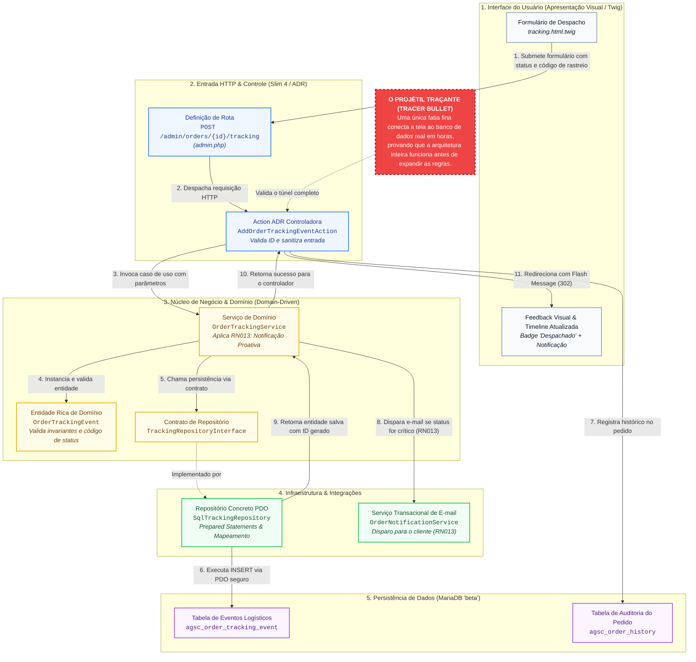

# Guia de Boas Práticas: Desenvolvimento em Fatias Verticais (Vertical Slice)

> **Público-alvo:** Desenvolvedores de software, arquitetos de sistemas, product managers e estudantes de tecnologia.  
> **Objetivo:** Compreender a teoria, a arquitetura de código e a aplicação prática do desenvolvimento em fatias verticais, da concepção visual em protótipos até a entrega contínua em produção com baixo acoplamento e testes ponta a ponta.

---

## 🧭 Sumário

1. [O Que é o Desenvolvimento em Fatias Verticais?](#1-o-que-é-o-desenvolvimento-em-fatias-verticais)
2. [Fatias Verticais vs. Camadas Horizontais Tradicionais](#2-fatias-verticais-vs-camadas-horizontais-tradicionais)
3. [Principais Vantagens Técnicas e de Negócio](#3-principais-vantagens-técnicas-e-de-negócio)
4. [Protótipos de Alta Fidelidade no Paradigma Vertical](#4-protótipos-de-alta-fidelidade-no-paradigma-vertical)
5. [Como Ajustar a Mentalidade e Evitar a "Armadilha Horizontal"](#5-como-ajustar-a-mentalidade-e-evitar-a-armadilha-horizontal)
6. [Evolução da Fatia: Tracer Bullet e Walking Skeleton](#6-evolução-da-fatia-tracer-bullet-e-walking-skeleton)
7. [Arquitetura de Código: Como Estruturar Fatias na Prática](#7-arquitetura-de-código-como-estruturar-fatias-na-prática)
8. [Gestão Visual: O Protótipo como Mapa de Fatiamento (User Story Mapping)](#8-gestão-visual-o-protótipo-como-mapa-de-fatiamento-user-story-mapping)
9. [Anti-Patterns e Armadilhas Comuns](#9-anti-patterns-e-armadilhas-comuns)
10. [Checklist do Desenvolvedor para Fatias Verticais](#10-checklist-do-desenvolvedor-para-fatias-verticais)

---

## 1. O Que é o Desenvolvimento em Fatias Verticais?

O **desenvolvimento em fatias verticais** (*Vertical Slice Development* ou *Vertical Slice Architecture*) é uma abordagem de engenharia de software na qual a construção de um sistema é organizada ao redor de **funcionalidades completas de negócio entregáveis**, em vez de ser dividida por camadas técnicas puras.

Em vez de construir todo o banco de dados da aplicação em um mês, depois todos os serviços em outro e por fim as telas, a equipe escolhe **um único caso de uso específico** (por exemplo: *"Cliente calcula frete"* ou *"Operador cancela pedido"*) e implementa esse fluxo atravessando **todas as camadas do sistema de ponta a ponta**:

```
           Abordagem Horizontal (Camadas Técnicas)
 ┌─────────────────────────────────────────────────────────────┐
 │ 1. Interface do Usuário (UI/UX)                             │  ← Desenvolvida isolada
 ├─────────────────────────────────────────────────────────────┤
 │ 2. Camada de Aplicação / Regras de Negócio (Services)       │  ← Sem feedback visual
 ├─────────────────────────────────────────────────────────────┤
 │ 3. Acesso a Dados / Persistência (Banco de Dados / SQL)     │  ← 100% pronta, 0% de uso real
 └─────────────────────────────────────────────────────────────┘

                                VS

             Abordagem Vertical (Fatias de Negócio)
 ┌───────────────────┬───────────────────┬───────────────────┐
 │   Fatia 1 (Auth)  │ Fatia 2 (Carrinho)│ Fatia 3 (Checkout)│
 │ ┌───────────────┐ │ ┌───────────────┐ │ ┌───────────────┐ │
 │ │ Tela de Login │ │ │ Tela Carrinho │ │ │ Tela Checkout │ │
 │ ├───────────────┤ │ ├───────────────┤ │ ├───────────────┤ │
 │ │ Regra de Auth │ │ │ Regra Totais  │ │ │ Regra Cobrança│ │
 │ ├───────────────┤ │ ├───────────────┤ │ ├───────────────┤ │
 │ │ Tabela User   │ │ │ Tabela Cart   │ │ │ Tabela Order  │ │
 │ └───────────────┘ │ └───────────────┘ │ └───────────────┘ │
 └───────────────────┴───────────────────┴───────────────────┘
```

Cada fatia representa uma entrega utilizável, testável e capaz de gerar valor real imediatamente.

---

## 2. Fatias Verticais vs. Camadas Horizontais Tradicionais

Para quem está aprendendo a programar, entender a diferença fundamental entre as duas abordagens poupa meses de retrabalho:

| Critério | Abordagem Horizontal (Camadas) | Abordagem Vertical (Fatias) |
|---|---|---|
| **Eixo de Organização** | Especialidade técnica (`Controllers/`, `Services/`, `Models/`) | Funcionalidade / Caso de Uso (`CriarPedido/`, `CalcularFrete/`) |
| **Geração de Valor** | Tardia (o cliente só vê algo funcionando quando todas as camadas se encontram no final) | Imediata (a cada fatia concluída, um recurso real já pode ser utilizado e homologado) |
| **Acoplamento** | Alto (alterar uma coluna no banco costuma reverberar em dezenas de services e DTOs) | Baixo (as regras e dados de uma fatia são autossuficientes e isolados das demais) |
| **Abstrações** | Prematuras (criação de repositórios e classes genéricas antes de saber se serão úteis) | Just-in-Time (apenas o código estritamente necessário para atender àquele caso de uso) |
| **Facilidade de Refatoração** | Difícil (código disperso em múltiplos diretórios distantes) | Alta (todo o código do caso de uso está co-localizado) |
| **Feedback de Stakeholders** | Demorado (semanas ou meses até o primeiro teste prático) | Rápido (dias ou horas para validar se atende à necessidade) |

---

## 3. Principais Vantagens Técnicas e de Negócio

### 3.1 Ciclo de Feedback Acelerado (Princípio Ágil)
Como a fatia conecta a interface ao banco de dados com regras reais, o usuário final ou o product owner consegue testar o comportamento prático do software desde o primeiro dia de desenvolvimento. Dúvidas de escopo e expectativas desalinhadas são descobertas na hora, e não meses depois.

### 3.2 Baixo Acoplamento e Alta Coesão
Em arquiteturas horizontais clássicas, a classe `ProductService` ou `OrderService` tende a se transformar em um monólito de milhares de linhas de código (*God Class*), onde dezenas de desenvolvedores alteram o mesmo arquivo gerando conflitos constantes de merge (*merge hell*). No fatiamento vertical:
- Cada caso de uso é um comando ou manipulador (*Handler*) independente.
- Alterar o cálculo da taxa de entrega não afeta nem quebra o cancelamento de pedidos.

### 3.3 Flexibilidade Tecnológica por Recurso (*Right-Sized Solutions*)
Nem todo recurso exige a mesma cerimônia:
- Uma **listagem simples de relatórios** pode executar uma consulta SQL otimizada direta com projeção rápida em DTO.
- Uma **operação financeira crítica** (como emissão de boleto ou transação de cartão) pode utilizar um agregador DDD completo com máquina de estados, eventos de domínio e idempotência.
O fatiamento vertical permite escolher a solução adequada para cada problema sem forçar todos os casos de uso a um mesmo molde rígido.

### 3.4 Redução de Código Morto e YAGNI (*You Aren't Gonna Need It*)
Evita-se a criação antecipada de métodos utilitários genéricos, interfaces universais com 50 métodos e estruturas de dados complexas que nunca chegam a ser chamadas pelo sistema real.

### 3.5 Caminho Natural para Microsserviços e Modularização
Se no futuro o módulo de cálculo de frete ou de emissão fiscal precisar se tornar um microsserviço independente com alta escala, todo o código já está reunido em torno desse caso de uso. Não há necessidade de dissecar centenas de arquivos espalhados em camadas horizontais.

---

## 4. Protótipos de Alta Fidelidade no Paradigma Vertical

Uma dúvida muito comum entre quem está começando na área é:  
> *"Se construímos o sistema em fatias verticais, criar protótipos visuais com dados fixos (mocks) é uma prática ruim?"*

**A resposta é NÃO.** Criar protótipos visuais de alta fidelidade com dados estáticos não quebra o paradigma de fatias verticais na verdade, é uma ferramenta essencial de **validação antecipada**.

A interface de usuário (UI) é o componente que conecta o cliente ao valor de negócio. Validar as telas, formulários e fluxos visuais antes de modelar tabelas no banco de dados economiza horas de refatoração de código. O fatiamento vertical só é quebrado quando o time constrói **dezenas de telas estáticas de uma só vez** e as abandona por meses sem ligar nenhuma delas ao backend real.

---

## 5. Como Ajustar a Mentalidade e Evitar a "Armadilha Horizontal"

Para garantir que o protótipo atue como catalisador e não como uma armadilha, observe três regras fundamentais:

```
  ┌────────────────────────────────────────────────────────────────────────┐
  │  Regra 1: Protótipo é Farol, Não Camada                                │
  │  Trate telas mockadas como rascunhos descartáveis ou gabaritos         │
  │  visuais. Nunca considere que o projeto está "50% pronto" só porque    │
  │  o HTML/CSS das telas foi desenhado.                                   │
  ├────────────────────────────────────────────────────────────────────────┤
  │  Regra 2: Fatie o Próprio Protótipo                                    │
  │  Prototipe a jornada de uma funcionalidade específica (ex: adicionar   │
  │  ao carrinho) e entregue-a para codificação ponta a ponta antes de     │
  │  começar a prototipar telas de áreas distantes do sistema.              │
  ├────────────────────────────────────────────────────────────────────────┤
  │  Regra 3: Alinhamento Transparente de Expectativas                     │
  │  Telas com dados estáticos transmitem a ilusão de produto acabado.     │
  │  Comunique claramente aos clientes que aquilo é uma maquete de        │
  │  validação visual e que a engenharia real será construída por fatias.  │
  └────────────────────────────────────────────────────────────────────────┘
```

---

## 6. Evolução da Fatia: Tracer Bullet e Walking Skeleton

O desenvolvimento correto após a validação visual do protótipo segue a construção da fatia mais fina possível (*Thin Vertical Slice*) e sua maturação progressiva:

```
  Passo 1: Protótipo (Estático)      Passo 2: Tracer Bullet (Mínima)      Passo 3: Fatia Madura (Completa)
┌───────────────────────────────┐   ┌───────────────────────────────┐   ┌───────────────────────────────┐
│ [UI] Dados mockados no front  │   │ [UI] Tela lê dados da API real│   │ [UI] Feedback, loading e erros│
│ [Log] Sem lógica de negócio   │ ➔ │ [Log] Regra essencial direta  │ ➔ │ [Log] Validações e transação  │
│ [DB] Sem persistência         │   │ [DB] Tabela simples conectada │   │ [DB] Índices, chaves e cascade│
└───────────────────────────────┘   └───────────────────────────────┘   └───────────────────────────────┘
```

### 1. *Walking Skeleton* (Esqueleto Andante)
A primeira fatia vertical do projeto implementa a infraestrutura básica de ponta a ponta com a menor regra possível (ex: cadastrar um registro simples com formulário, rota, banco e teste). Seu objetivo é provar que a arquitetura inteira consegue se comunicar e passar pelos pipelines de CI/CD.

### 2. *Tracer Bullet* (Projétil Traçante)
Cada nova fatia vertical dispara um "projétil traçante": uma implementação fina que atravessa todas as camadas do sistema para confirmar que a pontaria do negócio está certa. Uma vez validada a integração, a fatia recebe densidade:
- Validações de entrada rigorosas e regras de borda (*Edge Cases*).
- Tratamento de exceções e respostas de erro semânticas.
- Logs estruturados e métricas de observabilidade.
- Testes automatizados unitários e de integração.

---

### 3. Diagrama Prático: O Tracer Bullet Atravessando as Camadas (Fatia 33 do Projeto)

O diagrama abaixo — extraído do arquivo [`tracer-bullet.mmd`](tracer-bullet.mmd) — ilustra exatamente a jornada de um **Tracer Bullet** utilizando o caso real que acabamos de implementar na **Fatia 33** (Rastreamento Last-Mile e Histórico de Pedidos):



> 💡 **Lição de Engenharia:**  
> Observe como o projétil traçante não "pára no meio do caminho". Ele não cria uma tela bonita sem API, nem um controller sem banco. Ele perfura **todas as 5 camadas** com uma implementação mínima, mas real. Uma vez que o fluxo funciona de ponta a ponta, o desenvolvedor adiciona a densidade (tratamento de erros, edge cases e testes de regressão).

---

## 7. Arquitetura de Código: Como Estruturar Fatias na Prática

Na arquitetura de código, as fatias verticais são organizadas por **capacidades de negócio** (*Features*) em vez de pastas técnicas genéricas.

### Comparativo de Estruturas de Pastas:

#### ❌ Abordagem Horizontal Clássica (Camadas Isoladas):
```
src/
├── Controllers/
│   ├── ProductController.php
│   ├── OrderController.php
│   └── CustomerController.php
├── Services/
│   ├── ProductService.php
│   ├── OrderService.php
│   └── CustomerService.php
├── Repositories/
│   ├── ProductRepository.php
│   ├── OrderRepository.php
│   └── CustomerRepository.php
└── Models/
    ├── Product.php
    ├── Order.php
    └── Customer.php
```
> **Problema:** Para alterar uma regra no pedido, o desenvolvedor precisa abrir e modificar 4 arquivos espalhados em pastas diferentes, alternando contexto constantemente.

#### ✅ Abordagem em Fatias Verticais (Vertical Slice / Features):
```
src/
├── Features/
│   ├── Orders/
│   │   ├── CreateOrder/
│   │   │   ├── CreateOrderAction.php         # Entrada HTTP (Action ADR)
│   │   │   ├── CreateOrderCommand.php        # DTO de entrada tipado
│   │   │   ├── CreateOrderHandler.php        # Regra de negócio do caso de uso
│   │   │   ├── CreateOrderValidator.php      # Validações semânticas
│   │   │   └── create_order.html.twig        # Template de apresentação
│   │   ├── CancelOrder/
│   │   │   ├── CancelOrderAction.php
│   │   │   ├── CancelOrderHandler.php
│   │   │   └── cancel_order.html.twig
│   │   └── OrderTracking/
│   │       ├── ShowOrderTrackingAction.php
│   │       ├── OrderTrackingService.php
│   │       └── tracking.html.twig
│   └── Catalog/
│       └── CalculatePrice/
│           ├── CalculatePriceAction.php
│           └── CalculatePriceService.php
```

> **Vantagem:** Todo o contexto do caso de uso reside no mesmo diretório (*Co-location*). A coesão é máxima: entender, testar, alterar ou até mesmo apagar uma funcionalidade inteira torna-se uma operação rápida e segura.

---

## 8. Gestão Visual: O Protótipo como Mapa de Fatiamento (User Story Mapping)

Usar o protótipo de telas como mapa vivo do fatiamento vertical conecta o time de design, os gerentes de produto e os desenvolvedores de software em uma única linguagem.

### 8.1 Sistema de Cores e Status Visual do Desenvolvimento
Em ferramentas de design (como Figma) ou quadros Kanban, utilize marcações de status diretamente sobre os fluxos de navegação:

- 🟥 **Vermelho / Tracejado:** Funcionalidades planejadas para lançamentos futuros (*Backlog / Baixa Prioridade*).
- 🟨 **Amarelo / Alerta:** Fatias priorizadas selecionadas para o próximo ciclo de desenvolvimento.
- 🟦 **Azul / Em Construção:** Fatias verticais que a engenharia está codificando ponta a ponta neste momento.
- 🟩 **Verde / Sólido:** Fatias homologadas e integradas (UI real conectada ao backend e ao banco de dados).

### 8.2 O "Raio-X" da Tela: Fatiando Componentes Dentro de uma Mesma Visão
Raramente uma página inteira é uma única fatia vertical. Quase sempre, uma mesma interface comporta múltiplos casos de uso com diferentes níveis de complexidade:

```
┌────────────────────────────────────────────────────────────────────────┐
│  Página de Detalhes do Pedido                                         │
│                                                                        │
│  [Fatia A - Alta Prioridade] 🟩                                         │
│  Tabela de Itens Comprados, Totais e Endereço de Entrega (Núcleo)       │
│                                                                        │
│  [Fatia B - Média Prioridade] 🟦                                        │
│  Linha do Tempo de Rastreamento Last-Mile (Atualização de Status)       │
│                                                                        │
│  [Fatia C - Baixa Prioridade / Próxima Release] 🟥                      │
│  Botão "Solicitar Devolução / RMA" e Botão "Exportar Relatório em PDF" │
└────────────────────────────────────────────────────────────────────────┘
```

Ao aplicar o raio-X, a equipe implementa a **Fatia A** por completo (do banco à UI) e entrega para teste antes de escrever qualquer código da **Fatia B** ou da **Fatia C**.

### 8.3 Matriz de Lançamentos Incrementais (Releases)

| Fase de Entrega | Foco no Protótipo | Escopo da Fatia Vertical | Objetivo de Negócio |
|---|---|---|---|
| **Release 1 (MVP)** | Fluxo de Compra Primário (PDP ➔ Carrinho ➔ Checkout ➔ Sucesso) | Caminho feliz com pagamento simples e registro direto do pedido | Validar tração comercial e faturar o primeiro pedido com clientes reais |
| **Release 2 (Retenção)** | Área do Cliente e Histórico de Pedidos | Consulta de compras passadas e rastreamento de entregas | Dar autonomia ao consumidor e reduzir chamados de suporte |
| **Release 3 (Evolução)** | Sistema de Cupons, Devoluções e Recomendações | Regras promocionais avançadas e fluxos reversos | Otimizar margem, ticket médio e fidelização de usuários |

---

## 9. Anti-Patterns e Armadilhas Comuns

Para quem está aprendendo a arquitetar em fatias verticais, atenção a estes quatro erros frequentes:

### 1. A "Fatia Gorda" Demais (*Fat Slice*)
- **Erro:** Tentar incluir todo o CRUD de um domínio em uma única fatia (ex: "Fazer o módulo completo de clientes").
- **Solução:** Divida em fatias atômicas: 1) Cadastrar Cliente; 2) Listar Clientes; 3) Bloquear Cliente inadimplente.

### 2. O Protótipo que Vira Código de Produção Sem Arquitetura
- **Erro:** Usar o código de rascunho do protótipo estático em produção sem testes, sem camada de domínio e sem validações de segurança.
- **Solução:** Trate a casca da tela como gabarito, mas estruture a lógica interna com boas práticas (injeção de dependência, entidades e contratos).

### 3. Fatias com Regras Duplicadas Sem Refatoração Oportuna
- **Erro:** Duplicar cegamente regras críticas de negócio (como cálculo de impostos ou desconto) em dez fatias diferentes.
- **Solução:** Aplique a **Regra de Três** (*Rule of Three*): permita uma leve duplicação na primeira repetição; quando uma mesma regra pura de domínio for necessária pela terceira vez, extraia-a para um Objeto de Valor (*Value Object*) ou Serviço de Domínio compartilhado.

### 4. Esquecer os Testes Automatizados de Ponta a Ponta
- **Erro:** Validar a fatia apenas clicando manualmente no navegador e não escrever testes automatizados.
- **Solução:** Cada fatia vertical deve nascer acompanhada de:
  - **Testes Unitários:** Para as regras de negócio puras do domínio.
  - **Testes de Integração:** Para validar que a rota HTTP executa a ação, grava no banco de dados e retorna o status esperado.

---

## 10. Checklist do Desenvolvedor para Fatias Verticais

Antes de considerar uma fatia vertical pronta para entrega (*Definition of Done*), utilize este checklist:

- [ ] **1. Escopo Delimitado:** O caso de uso resolve exatamente uma intenção clara do usuário ou do sistema.
- [ ] **2. Banco de Dados / Migração:** A tabela ou campos necessários foram versionados em migrations DDL limpas e idempotentes.
- [ ] **3. Domínio e Regras de Negócio:** A lógica reside em classes de domínio coesas com validação de invariantes, sem depender diretamente do framework.
- [ ] **4. Camada de Apresentação / Rotas:** A rota HTTP está devidamente registrada com verbos semânticos (GET, POST, PUT, DELETE) e proteção de acesso.
- [ ] **5. Interface de Usuário:** A visualização (Twig, Blade ou Front-end) consome os dados reais do backend com estados adequados de carregamento, sucesso e erro.
- [ ] **6. Segurança e Permissões:** O acesso ao recurso é validado (autenticação, autorização de perfil e proteção contra IDOR).
- [ ] **7. Testes Automatizados:** Suítes unitárias e de integração foram escritas e estão passando sem falhas no ambiente de teste.
- [ ] **8. Sem Regressão:** A suíte completa de testes do sistema continuou 100% verde após a inclusão da nova fatia.
