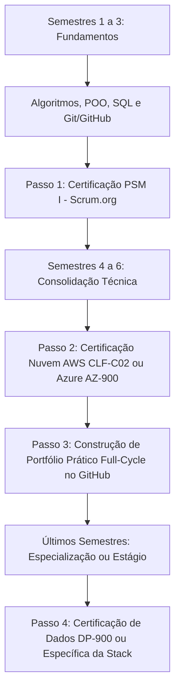

# 🎓 Guia de Carreira, Certificações e Disciplinas: Do Estudante ao Engenheiro de Software

Este guia foi elaborado para responder com clareza a estudantes de **Análise e Desenvolvimento de Sistemas (ADS)**, **Ciência da Computação** e **Engenharia de Software** a duas perguntas centrais:
1. **Quais disciplinas e fundamentos técnicos eu devo realmente dominar para atuar em desenvolvimento de software?**
2. **Quais certificações valem a pena obter durante a faculdade e no início da carreira?**

---

## 📑 Sumário
1. [O Papel do Analista e do Engenheiro de Software na Era da IA](#-1-o-papel-do-analista-e-do-engenheiro-na-era-da-ia)
2. [Disciplinas Fundamentais da Faculdade para o Ramo Dev](#-2-disciplinas-fundamentais-para-desenvolvimento-de-software)
3. [Estratégia do Profissional em "T"](#-3-a-estratégia-do-profissional-em-t)
4. [Certificações Recomendadas para Estudantes e Iniciantes](#-4-certificações-recomendadas-para-estudantes-e-iniciantes)
5. [Panorama de Certificações Globais por Vertical Técnica](#-5-panorama-de-certificações-globais-por-vertical)
6. [Onde Vale a Pena Certificar vs. Onde Apenas Ter Conhecimento Prático](#-6-onde-vale-a-pena-certificar-vs-onde-apenas-conhecer)
7. [Trilha Prática Passo a Passo Durante a Graduação](#-7-trilha-prática-passo-a-passo-durante-a-graduação)
8. [Especializações e Trilhas por Foco de Atuação](#-8-especializações-e-trilhas-por-foco-de-atuação)
   - [8.1. Padrões de Código, Clean Code e Ecossistemas de Backend](#-81-padrões-de-código-clean-code-e-ecossistemas-de-backend)
   - [8.2. Ramo: Engenharia de Backend e APIs](#-82-ramo-engenharia-de-backend-e-apis)
   - [8.3. Ramo: Engenharia de Frontend e Web Moderno](#-83-ramo-engenharia-de-frontend-e-web-moderno)
   - [8.4. Ramo: Engenharia de Dados e Business Intelligence](#-84-ramo-engenharia-de-dados-e-business-intelligence)
   - [8.5. Ramo: Engenharia de Qualidade e Automação de Testes (QA/SDET)](#-85-ramo-engenharia-de-qualidade-e-automação-de-testes-qasdet)
   - [8.6. Ramo: DevOps, Cloud e Plataforma](#-86-ramo-devops-cloud-e-plataforma)

---

## 🤖 1. O Papel do Analista e do Engenheiro na Era da IA

Com o avanço de assistentes e agentes autônomos de código, o mercado passou da era do *"desenvolvedor dicionário"* (que se destacava por decorar sintaxe) para a era do **Engenheiro de Curadoria, Arquitetura e Contexto**.

> 💡 **A regra de ouro:** *Não dispute velocidade de digitação com a Inteligência Artificial; dispute direção e discernimento técnico. A IA tem a tração, mas você tem o volante.*

### Os 4 Pilares do Novo Perfil Profissional:
1. **Subir na Cadeia de Abstração (O "Porquê" e o "O quê"):** A IA sabe como implementar uma rotina, mas cabe ao analista definir requisitos de negócio, regras fiscais, critérios de aceite e requisitos não funcionais (escalabilidade, latência, custos).
2. **Combater o "Código Frankenstein":** Códigos gerados por IA funcionam bem isoladamente, mas podem gerar vazamento de memória, vulnerabilidades OWASP Top 10 e gargalos arquiteturais graves quando acoplados. O profissional é o validador técnico da entrega.
3. **Orquestração e Visão Sistêmica (Full-Cycle):** Entender a jornada completa: do protótipo no frontend, passando pelas APIs/mensageria e persistência no banco, até o deploy via pipeline CI/CD na nuvem.
4. **Engenharia de Contexto e Sistemas Agênticos:** Saber formular prompts estruturados, integrar bases com Retrieval-Augmented Generation (RAG) e orquestrar múltiplos agentes de desenvolvimento.

---

## 📚 2. Disciplinas Fundamentais para Desenvolvimento de Software

A faculdade oferece uma formação ampla. Para focar em desenvolvimento e análise de software de excelência, priorize a assimilação profunda das seguintes matérias:

| Disciplina / Matéria | Por que é Crucial? | Onde se Aplica no Dia a Dia |
|---|---|---|
| **Algoritmos e Estruturas de Dados** | É a base da eficiência computacional (complexidade Big-O, arrays, grafos, filas, árvores). | Otimização de processamento, testes técnicos de contratação e escolha correta de estruturas de dados. |
| **Bancos de Dados (Modelagem e SQL)** | Nenhum sistema corporativo sobrevive sem persistência confiável. | Desenho de esquemas (1ª a 3ª Formas Normais), queries complexas, índices, integridade referencial e transações ACID. |
| **Engenharia de Software e Requisitos** | Transforma problemas do mundo real em especificações e entregas técnicas mensuráveis. | Histórias de usuário, critérios de aceite, documentação de regras de negócio, estimativas e ciclo de vida do software. |
| **Padrões de Projeto (Design Patterns) e POO** | Ensina a escrever código extensível, legível e de fácil manutenção (princípios SOLID, Factory, Strategy, etc.). | Manutenibilidade do código gerado (inclusive por IA), desacoplamento e desenvolvimento em equipe. |
| **Arquitetura de Software e Microsserviços** | Determina como os componentes de um sistema se comunicam e escalam. | Criação de APIs RESTful, gRPC, mensageria (RabbitMQ/Kafka) e decomposição de monólitos. |
| **Redes de Computadores e Sistemas Operacionais** | Ensina como a infraestrutura física e lógica conversa. | Protocolos HTTP/HTTPS, DNS, portas, threads, consumo de memória, permissões e comunicação cliente-servidor. |
| **Segurança da Informação (DevSecOps)** | Protege dados sensíveis e previne ataques e vazamentos. | OWASP Top 10, autenticação/autorização (JWT, OAuth2), sanitização de inputs e conformidade com LGPD/GDPR. |
| **Qualidade e Testes de Software** | Garante que novas alterações não quebrem funcionalidades já entregues. | Testes unitários, de integração, TDD/BDD e automação de testes em esteiras CI/CD. |

---

## 🎯 3. A Estratégia do Profissional em "T"

O analista de sistemas bem-sucedido adota o perfil **T-Shaped**:
* **Barra Horizontal (Visão Holística e Generalista):** Conhecimento básico de UI/UX, noções de redes, infraestrutura em nuvem, metodologias de design e governança corporativa.
* **Barra Vertical (Especialidade Técnica):** Domínio prático em engenharia de requisitos, lógica/código robusto em uma stack principal, modelagem de dados e desenho de arquiteturas de integração.

---

## 🎓 4. Certificações Recomendadas para Estudantes e Iniciantes

Para quem está cursando ADS ou Ciência da Computação, o objetivo não é colecionar dezenas de certificados, mas **comprovar competências-chave que reduzem o custo de treinamento para as empresas**:

### 1. Metodologias Ágeis (Diferencial Imediato)
* **PSM I (Professional Scrum Master I - Scrum.org):**  
  * *Por que vale a pena:* Reconhecimento global definitivo sobre o ciclo Scrum; a credencial **não expira** (diferente da CSM), sendo o melhor custo-benefício para universitários.

### 2. Fundamentos de Cloud Computing (Imprescindível)
Os sistemas modernos já nascem na nuvem. Ter um selo de fundamentos comprova maturidade técnica:
* **AWS Certified Cloud Practitioner (CLF-C02):** Introdução sólida aos conceitos, custos e ecossistema da líder de mercado AWS.
* **Microsoft Certified: Azure Fundamentals (AZ-900):** Excelente aceitação corporativa e frequentemente disponibilizada em programas acadêmicos.

### 3. Dados e Banco de Dados
* **Microsoft Certified: Azure Data Fundamentals (DP-900):** Valida conceitos essenciais de dados relacionais (SQL), semiestruturados e não relacionais (NoSQL).

### 4. Linguagem e Programação
* **Oracle Certified Associate / Professional Java SE:** Se o foco acadêmico for Java, o selo da Oracle é um forte diferencial em processos seletivos concorridos para desenvolvedor júnior.
* Alternativamente, comprovações em ecossistemas Python (ex: PCEP) ou certificações práticas em plataformas como HackerRank/LeetCode associadas a um GitHub ativo.

> 💰 **Dica de Financiamento Estudantil:**  
> A Microsoft (Microsoft Learn for Students) e a Oracle frequentemente distribuem **vouchers com até 100% de desconto** para estudantes universitários cadastrados com e-mail institucional (`.edu` ou similar). Verifique essas oportunidades antes de investir o valor integral da prova.

---

## 🌐 5. Panorama de Certificações Globais por Vertical

À medida que o profissional avança para os níveis pleno e sênior, as credenciais se aprofundam por verticais de mercado:

| Vertical | Certificações de Entrada / Pleno | Certificações Avançadas / Especialista |
|---|---|---|
| **Computação em Nuvem** | AWS Solutions Architect Associate, Azure Administrator (AZ-104) | AWS Solutions Architect Professional, Google Cloud Professional Cloud Architect |
| **DevOps e Contêineres** | Docker Certified Associate (DCA), CKA (Certified Kubernetes Administrator) | CKS (Certified Kubernetes Security Specialist) |
| **Qualidade e Testes (QA)** | ISTQB Certified Tester Foundation Level (CTFL) | ISTQB Agile Tester, ISTQB Test Automation Engineer |
| **Cibersegurança** | CompTIA Security+ | CISSP ((ISC)²), CEH (Certified Ethical Hacker) |
| **Redes e Conectividade** | Cisco CCNA | Cisco CCNP, CCIE |
| **Governança e Negócios** | ITIL 4 Foundation, PSPO I (Scrum Product Owner) | PMP (Project Management Professional), TOGAF, PMI-PBA |

---

## ⚖️ 6. Onde Vale a Pena Certificar vs. Onde Apenas Conhecer

Um erro comum é tentar certificar tecnologias que fogem ao escopo do desenvolvimento e da análise de sistemas:

| Área | Relevância para o Analista / Dev | Vale Certificação? | Recomendação de Abordagem |
|---|---|:---:|---|
| **Bancos de Dados** | Altíssima | **Sim** | Focar em modelagem, otimização de consultas e certificados de fundamentos de dados (ex: DP-900 ou certificações SQL). |
| **Metodologias Ágeis** | Altíssima | **Sim** | Obter PSM I da Scrum.org para comprovar adaptação a times modernos de engenharia. |
| **Cloud Computing** | Altíssima | **Sim** | Obter ao menos 1 certificado de fundamentos (AWS Cloud Practitioner ou Azure AZ-900). |
| **Testes (QA)** | Alta | **Opcional / Sim** | Se o perfil for voltado à qualidade e homologação de requisitos, a ISTQB CTFL agrega enorme valor. |
| **UI / UX Design** | Média | **Não** | Não invista em provas caras. Pratique prototipação no Figma e conheça princípios de usabilidade e Design Thinking. |
| **Redes Tradicionais** | Baixa-Média | **Não** | O CCNA exige foco pesado em switches e roteadores físicos. Para o analista, o conhecimento de redes obtido nas certificações de Nuvem (VPCs, subnets, gateways, DNS) é o suficiente. |

---

## 🗺️ 7. Trilha Prática Passo a Passo Durante a Graduação

Para um estudante, clareza e cadência valem mais que sobrecarga:

### Checklist para o Estudante:
- [ ] Construir uma base sólida de Algoritmos, Estruturas de Dados e SQL.
- [ ] Manter um repositório GitHub com projetos funcionais contendo documentação (README bem escrito), APIs documentadas e testes automatizados.
- [ ] Obter a certificação de processos ágeis (PSM I) para destravar oportunidades em equipes estruturadas.
- [ ] Obter uma certificação introdutória de nuvem (AWS ou Azure) aproveitando parcerias acadêmicas.
- [ ] Aplicar IA generativa como ferramenta de produtividade, exercendo senso crítico na revisão do código e nas decisões de arquitetura.

## 📚 8. Especializações e Trilhas por Foco de Atuação

Quando o estudante decide em qual ramo quer se aprofundar (definindo a haste vertical do seu "T"), a estratégia de estudo e validação muda. Abaixo estão os principais ramos do desenvolvimento de software com as disciplinas acadêmicas essenciais, certificações que o mercado valoriza e a forma correta de validação prática.

---

### 🎯 8.1. Padrões de Código, Clean Code e Ecossistemas de Backend

Tópicos avançados de Engenharia de Software (Design Patterns, SOLID, Arquitetura Limpa e padrões de interoperabilidade como PSR/PER) são exaustivamente cobrados em entrevistas técnicas e provas corporativas.

#### 1. Certificações Oficiais de Ecossistemas
* **Java:** *Oracle Certified Professional: Java SE Developer*. Foca em POO avançada, concorrência, streams, generics e boas práticas da JVM.
* **PHP:** *Zend Certified PHP Engineer* e *Symfony Certification*. Cobrem orientação a objetos avançada, Design Patterns (Factory, Dependency Injection, Observer, Strategy) e conformidade estrita com padrões da PHP-FIG.
* **C# / .NET:** *Microsoft Certified: DevOps Engineer Expert* ou trilhas focadas em C# e ASP.NET Core no Microsoft Learn.

#### 2. Certificações Acadêmicas e de Especialização em Arquitetura
* **Software Design and Architecture Specialization (University of Alberta / Coursera):** Foco aprofundado nos 23 padrões clássicos do GoF (Gang of Four), coesão, acoplamento e revisões técnicas de código.
* **Desenvolvimento Ágil com Padrões de Projeto (ITA / Coursera):** Excelente credencial brasileira que une padrões comportamentais/estruturais a ciclos ágeis de entrega.

#### 💡 Como o Mercado Realmente Valida Padrões e Estilo (PHP-FIG, PEP8, Clean Code)?
O RH e os Tech Leads não exigem um "diploma de formatação"; **eles inspecionam o teu GitHub**. Para provar maturidade:
1. Integre, no teu repositório, ferramentas de análise estática e linting:
   - **PHP:** `PHP_CodeSniffer` / `PHP-CS-Fixer` (com regras PER-CS / PSR-12) e `PHPStan` (nível 6+) / `Psalm`.
   - **Python:** `Ruff`, `Flake8`, `Black` e `MyPy`.
   - **Node/TypeScript:** `ESLint`, `Prettier` e TypeScript em modo `strict`.
2. Configure **GitHub Actions** para rodar linter e testes em todo Pull Request.
3. Exiba o badge de status do pipeline no topo do teu `README.md`.

---

### ⚙️ 8.2. Ramo: Engenharia de Backend e APIs

O engenheiro de backend cuida da lógica de negócio, persistência transacional, escalabilidade e comunicação entre serviços.

* **Disciplinas Acadêmicas Obrigatórias:**
  - *Algoritmos e Estruturas de Dados Avançadas* (análise de complexidade, árvores, tabelas hash).
  - *Bancos de Dados Relacionais e Não-Relacionais* (transações ACID, índices B-Tree, particionamento).
  - *Sistemas Distribuídos e Redes* (protocolos HTTP/2 e HTTP/3, gRPC, WebSockets, mensageria).
* **Certificações Recomendadas:**
  - **Entrada:** *AWS Cloud Practitioner* ou *Azure Fundamentals (AZ-900)*.
  - **Pleno:** *AWS Certified Developer - Associate* ou *Microsoft Certified: Azure Developer Associate (AZ-204)*.
* **O que Provar no Portfólio (GitHub):**
  - Uma API RESTful ou gRPC bem documentada via Swagger/OpenAPI.
  - Autenticação e Autorização robusta (OAuth2 / JWT com Refresh Token).
  - Filas e Mensageria assíncrona (RabbitMQ, Apache Kafka ou Redis Streams).
  - Cobertura de testes unitários e de integração com banco de dados em contêineres (`Testcontainers` ou `Docker Compose`).

---

### 🎨 8.3. Ramo: Engenharia de Frontend e Web Moderno

O desenvolvedor frontend moderno gerencia estado complexo, renderização performática no cliente e no servidor (SSR), acessibilidade e experiência do usuário (UX).

* **Disciplinas Acadêmicas Obrigatórias:**
  - *Interação Humano-Computador (IHC) e Usabilidade.*
  - *Programação Web e Engenharia de Software.*
  - *Redes de Computadores* (ciclo de requisições, caching, CDN, CORS, headers de segurança).
* **Certificações Recomendadas:**
  - *Atenção:* O mercado de frontend quase não exige certificações formais proprietárias.
  - Certificados reconhecidos: *Meta Front-End Developer Professional Certificate (Coursera)* ou credenciais oficiais de plataformas especializadas (como *freeCodeCamp* ou certificações TypeScript).
* **O que Provar no Portfólio (GitHub / Produção):**
  - Aplicações construídas com frameworks consolidados (React/Next.js, Vue/Nuxt, Angular).
  - Domínio estrito de **TypeScript**, sem uso indiscriminado de `any`.
  - Acessibilidade web (normas WCAG) e notas altas de performance no Google Lighthouse (Core Web Vitals).
  - Design System próprio ou reutilizável e testes de interface (Jest, Vitest, Playwright ou Cypress).

---

### 📊 8.4. Ramo: Engenharia de Dados e Business Intelligence

Para estudantes que desejam lidar com pipelines de dados em larga escala, modelagem dimensional e infraestrutura de Big Data/Analytics.

* **Disciplinas Acadêmicas Obrigatórias:**
  - *Bancos de Dados Avançados e Data Warehousing* (modelagem Star Schema e Snowflake).
  - *Probabilidade, Estatística e Álgebra Linear.*
  - *Estruturas de Dados e Processamento Paralelo/Distribuído.*
* **Certificações Recomendadas:**
  - **Entrada:** *Microsoft Certified: Azure Data Fundamentals (DP-900)*.
  - **Intermediário/Pleno:** *Databricks Certified Data Engineer Associate* ou *Azure Data Engineer Associate (DP-203)*.
* **O que Provar no Portfólio (GitHub):**
  - Pipelines de ingestão e transformação ETL/ELT automatizados (Airflow, dbt, Spark).
  - Integração com Data Lakes e Data Warehouses modernos (DuckDB, BigQuery, Snowflake ou Postgres).
  - Validação de qualidade de dados (Great Expectations, Pandera).

---

### 🧪 8.5. Ramo: Engenharia de Qualidade e Automação de Testes (QA/SDET)

O papel do QA moderno (Software Development Engineer in Test) envolve escrever código para testar código, garantindo qualidade contínua na esteira de desenvolvimento.

* **Disciplinas Acadêmicas Obrigatórias:**
  - *Qualidade e Testes de Software* (critérios de cobertura, caixa-preta, caixa-branca, testes de mutação).
  - *Engenharia de Requisitos* (BDD - Behavior-Driven Development, critérios de aceitação).
  - *Lógica de Programação e Arquitetura de Software.*
* **Certificações Recomendadas:**
  - **Padrão-Ouro Global:** *ISTQB Certified Tester Foundation Level (CTFL)* — altíssimo reconhecimento na contratação.
  - **Avançadas:** *ISTQB Agile Tester* ou *ISTQB Test Automation Engineering*.
* **O que Provar no Portfólio (GitHub):**
  - Suítes de testes end-to-end (E2E) automatizados utilizando Playwright, Cypress ou Selenium.
  - Testes de carga e estresse de APIs com k6 ou JMeter.
  - Execução automática de testes disparada em esteiras CI/CD com geração de relatórios de cobertura.

---

### ☁️ 8.6. Ramo: DevOps, Cloud e Engenharia de Plataforma

Para quem tem afinidade com infraestrutura como código, automação de deploys, observabilidade e confiabilidade de sistemas (SRE).

* **Disciplinas Acadêmicas Obrigatórias:**
  - *Sistemas Operacionais* (Linux, kernel, processos, namespaces e cgroups).
  - *Redes de Computadores* (TCP/IP, roteamento, balanceamento de carga, VPNs, TLS).
  - *Segurança da Informação e Criptografia.*
* **Certificações Recomendadas:**
  - **Fundamentos:** *AWS Cloud Practitioner (CLF-C02)* ou *Linux Foundation Certified Associate (LFCA)*.
  - **Pleno/Diferencial de Mercado:** *CKA (Certified Kubernetes Administrator)* e *HashiCorp Certified: Terraform Associate*.
* **O que Provar no Portfólio (GitHub):**
  - Infraestrutura provisionada como código (IaC) via Terraform ou OpenTofu.
  - Pipelines declarativos de CI/CD (GitHub Actions, GitLab CI) com testes, lint, build de imagens Docker e deploy automático.
  - Painéis de observabilidade configurados (Prometheus, Grafana, OpenTelemetry).
